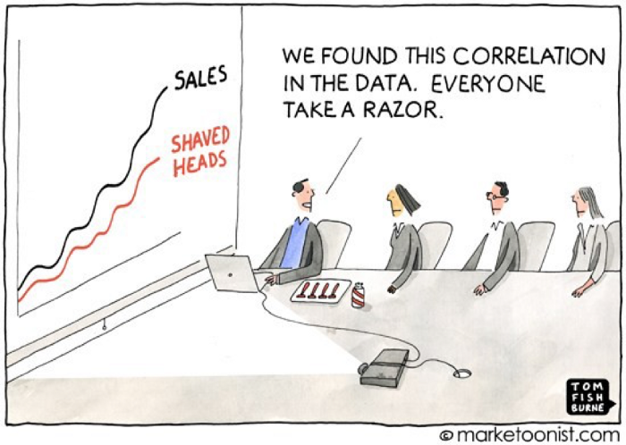
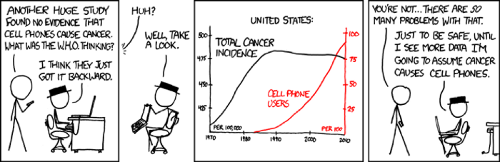

```{r, echo=FALSE, message=FALSE, warning=FALSE}
setwd("C:/Users/bpu058246/Desktop/Teaching/Econometria/Lectures/")
```


## Working Method
.font100[
- Presencial
- Expository classes + Laboratorial work
]

## Pre-requirements
.font100[
- Introductory Econometrics at the undergraduate level
]

## Policies
.font100[
- Do reading before class

- Do exercises after class to check your understanding

- Ask questions in the course

- Students must attend at least 75% of classes to be eligible for exams
]

---

## Software
.font100[
- R
- Stata
]

## Evaluation 
.font100[
- Test

- Practical or project work

    - The final grade is the average of the two evaluations.
    - A minimum of 10 is required in each evaluation
]


## [Contact](up649687@g.uporto.pt) 


---


# References

.font100[

**Textbooks**

#### Marno Verbeek (2017), A Guide to Modern Econometrics, 5th ed. Wiley, ISBN 9781119401100. 

#### William H. Greene (2020), Econometric Analysis, 8th ed. Pearson, ISBN: 978-0-13-446136-6.

#### Jeffrey M. Wooldridge (2012), Introductory Econometrics: A Modern Approach, 5th ed. Cenage Learning, ISBN 978-1111531041. 

#### Jeffrey M. Wooldridge (2010), Econometric Analysis of Cross Section and Panel Data, 2nd ed. The MIT Press, ISBN: 9780262232586. 

#### Joseph Adler (2012), R in a Nutshell, 2nd ed. Reilly, ISBN 978-1-449-31208-4.


]

---


# References

.font100[

**Programming**

#### [R Cookbook, 2nd Edition](https://rc2e.com/)

#### [Introduction to Econometrics with R](https://www.econometrics-with-r.org/): Practice with the exercises!

#### [Introductory Econometrics Examples](https://justinmshea.github.io/wooldridge/articles/Introductory-Econometrics-Examples.html#chapter-13-pooling-cross-sections-across-time-simple-panel-data-methods-1)

#### [Reproducible Finance with R](http://www.reproduciblefinance.com/start-here/)


#### Christopher F. Baum (2016), An Introduction to Stata Programming, 2nd ed. Stata Press, ISBN: 978-1-59718-150-1.


]

---


# References

.font100[

**Data Sets**

#### [Data Sets for Econometrics](https://cran.r-project.org/web/packages/Ecdat/Ecdat.pdf)

#### [Data Sets from "Introductory Econometrics: A Modern Approach" by Jeffrey M. Wooldridge](https://cran.r-project.org/web/packages/wooldridge/wooldridge.pdf)

[Other Materials](https://github.com/JustinMShea/wooldridge)


#### [Introductory Econometrics Examples](https://justinmshea.github.io/wooldridge/)

```{r eval = FALSE}
install.packages("Ecdat")
library("Ecdat")
install.packages("wooldridge")
library("wooldridge")
```

]


---

# What is Econometrics?


<blockquote>
Definition 1: econometrics = econo+ metrics
</blockquote>

- Econometrics is the marriage between economic models and the modern practice of econometrics.

.font120[
.blue[
**Economics vs. Econometrics**
]
]

.font80[

- Economics: focus on “how” and “why”

- Econometrics: focus on “how much” and “by how much”
    
    - Economist: “If the government increases alcohol excise tax, consumers will cut down on their alcohol consumption.”
    
    - Econometrician: “If the government increases alcohol excise tax by 20%, consumers will reduce their alcohol consumption by 1%.”
    
    
- Is econometrics a part of statistics? 

    - Not quite – economic data give rise to methods unparalleled in any branch of statistics.
    

- Econometrics is absolutely vital in applying economic theories in practice!

    - Reflected in the number of econometricians among Nobel prize laureates

]
---

# What is Econometrics?

<blockquote>
Definition 2: econometrics = statistics for economists
</blockquote>

- Econometrics is not concerned with the numbers themselves, but rather with the methods used to obtain the information


.font120[
.blue[
**Textbook definitions of econometrics**
]
]

.font90[
- “Application of mathematical statistics to economic data to lend empirical support to models constructed by mathematical economics and to obtain numerical estimates.” (Samuelson et al., Econometrica, 1954)

- “Application of mathematics and statistical methods to the analysis of economic data.“ (www.wikipedia.org)

- Econometrics is the science of deriving **causal conclusions** from non-experimental data (e.g., business data, administrative and tax records, etc.)

- Econometrics facilitates **causal inferences** by using statistical methods to control for confounding factors


]
 

---

# Why Study Econometrics?


<br />

<br />


.font100[
*The Master in the Economics of Business and Strategy was designed to enable students to successfully grasp and tackle this dynamic environment, either as managers or researchers.*

*Students are provided foundations in economic theory and a powerful set of cutting-edge analytical tools, allowing them to effectively solve real business situations.*
]

<br />

---
# Why Study Econometrics?

#### **Confront theory with real-world data**

.font90[

- Use of statistical techniques to understand economic issues and test theories
    
    - Provides the tools to enable extraction of useful information about important economic issues from the available data (e.g., evaluate the effectiveness of a publicly funded job training program; study the returns on different investment strategies)

    - To test a hypothesis (e.g., how much of the "gender pay gap" can be explained by differences in education and experience)
    
    - To estimate a key parameter (e.g., market risk, known as beta in the CAPM model)
    
    - To generate forecasts (e.g., predict economic recessions, determine the level that the base interest rate should be set each month)

    
- Without evidence, economic theories are abstract and might have no bearing on reality (even if they are completely rigorous)

]   

---

# Why Study Econometrics?

#### **Confront theory with real-world data**

.font120[
.blue[
**Examples**
]
]

.font90[

- Does attending an elite college bring an expected payoff in expected lifetime income sufficient to justify the higher tuition? [Kreuger and Dale (1999) and Kreuger (2000)]

- Does a voluntary training program produce tangible benefits? Can these benefits be accurately measured? [Angrist (2001)]

- Does an increase in the minimum wage lead to reduced employment? [Card and Krueger (1994)]

- Do smaller class sizes bring real benefits in student performance? [Hanuschek (1999), Hoxby (2000), and Angrist and Lavy (1999)]
  

]


---

# Basic Econometric Questions

.font120[
.blue[
**Descriptive**
]
]
    
- How much do men and women earn annually on average in Portugal? How long do recessions typically last?

- Main trait: all these question mean “how much … on average or typically”. If we had enough data, we would know the answer for sure

- Challenges: 

    - Sampling: how to make conclusions based on a sample rather than the whole population (random sampling & statistical inference)
    
    - Summary statistics: how to summarize the (quantitative) answer in a nice, brief and comprehensible way
    
---

# Basic Econometric Questions

.font120[
.blue[
**Forecasting**
]
]


- What will the global temperature be in 2040? How long will the recession last this year? Highly visible applications of econometrics: forecasts of macroeconomic indicators (interest rates, inflation, GDP etc.)

- Main trait: 

    - We can never know the answers for sure in advance; but if we wait long enough, we’ll know the answer. 
    
    - There might be very high stakes behind these questions
    
    - Inferences are drawn based on time-related data (i.e., time series)


    
---

# Basic Econometric Questions

.font120[
.blue[
**Causal**
]
]


- If the federal reserve lowers interest rates today, what will happen to inflation tomorrow? What is the effect of political campaign expenditures on voting outcomes? How much more money will you earn as a result of taking this course?

- Main trait: 

    - The cause(s) and the effect should always be distinguished. 
    
    - The presence of a causal link is suggested by economic theory (or common sense), the goal of econometric analysis is either to empirically verify or quantify this causal link.
    
    
---

# Causality and Correlation
    
- Correlations are easy to get but not informative.

- Correlations go both ways. Any causal statement, by definition, is one way.

<div align="center">

</div>


---

# Causality and Correlation

- It’s easy to watch correlated data change in tandem and assume that one thing causes the other.

    - *When your height increased, your mass increased too. But getting taller didn’t make you also get wider. Instead, maturing to adulthood caused both variables to increase*

- **The illusion of causality**: there are many forms of cognitive bias or irrational thinking patterns that often lead to faulty conclusions and economic decisions.

    - *Millions of people believed that buying a home for much more than its actual value would continue to result in a return on the investment just because that happened in the past.*
    
    
---

# Causality and Correlation

.font120[
.blue[
**Cell phones cause cancer or the reverse?**
]
]

<br \>

<div align="center">

</div>


  
---

# Causality and Ceteris Paribus

.font90[

- In economic thinking, causal relations are strongly connected with the notion of ceteris paribus (“other things being equal”)

    - Example: Consumer demand analysis – increasing a price makes consumers buy less ceteris paribus (however, if other factors change, anything can happen)
    
- If one could run an experiment with ceteris paribus conditions enforced, it would be easy to verify and evaluate the causal link
    
- This is the way things are done in natural sciences
    
    - Example: with decreasing air pressure, lower water temperature is needed for it to boil and turn into steam
    
- In social sciences, such controlled experiments are either impossible, unethical or prohibitively expensive

    - Example: political campaign expenditures – impossible to re-run the election with different campaign budgets
    
]    


---

<div class="navy" align="center">

<iframe width="700" height="500" src="https://www.youtube.com/embed/c-OF0OaK3o0" frameborder="0" allow="accelerometer; autoplay; encrypted-media; gyroscope; picture-in-picture" allowfullscreen></iframe>

</div>

<div class="navy" align="center">
Three Identical Strangers Trailer #1 (2018)
</div>
    
---

# Causality and Experiments

- We can distinguish between

    - experimental data: “created” in a laboratory experiment
    
    - non-experimental/observational data: researcher = passive collector of the data

- A large part of econometrics deals with how to get “correct” results despite working with non-experimental data.

<blockquote>
Econometric tools cannot be used to find causal links; these have to be found in economic theory. Econometrics can help us quantify causal effects and/or verify their presence. The challenge in here consist in dealing with non-experimental data where ceteris paribus conditions cannot be established.
</blockquote>


---

# Causality and Experiments

Sometimes, even in experiments related to natural sciences, it is impossible to enforce ceteris paribus conditions

.font85[

- Example: assessing the effect of a new fertilizer on soybeans

- Ceteris paribus = ruling out other yield-affecting factors such as rainfall, quality of land, presence of parasites etc.

- Experimental design:

    - 1.Choose several one-acre plots of land.
    
    - 2.Apply different amounts of fertilizer to each plot.
    
    - 3.Use statistical methods to measure the association between yields and fertilizer amounts.

]


---

# Causality and Experiments


.font85[

- Drawback: some of yield-affecting factors are not fully observed --> impossible to choose “identical” plots of land

- Solution: statistical procedures still work correctly, if fertilizer amounts are independent of the other factors, e.g., if we choose fertilizer amounts completely at random  --> hence randomized experiments

]


<blockquote>
If carried out properly, randomized experiments can substitute the ceteris paribus conditions. However, in social sciences,these experiments are typically either impossible, or at least unethical or extremely costly to conduct.
</blockquote>

- Example: Regulation SHO

    
---

# Steps in Empirical Analysis

.font80[

**Step 1**: Formulate the question of interest.

**Step 2**: Find a suitable economic model.

- formal relationships between economic variables

$$wage=f(education, experience, training)$$

**Step 3**: Turn it into an econometric model.

- Specify the function form f (•) of the economic relationships

- Deal with variables and quantification
    
$$wage=\beta_0 +\beta_1education+\beta_2 experience+\beta_3 training+u$$ 

$u$ is the error termor disturbance, which contains unobserved factors, measurement errors, and random nature of human behaviour

**Step 4**: Obtain suitable data.

**Step 5**: Use econometric methods to estimate the econometric model.

**Step 6**: If needed, use hypothesis tests to answer the question from step 1.

- If training plays a role in wage, then $\beta_3=0$ 


]    
---

# Econometric Modeling

.font85[

- Econometric analysis usually begins with a statement of a theoretical proposition.

- Economic theories are typically sharp and unambiguous 

    - Dependent and independent variables are identified, a functional form is specified, and in most cases, at least a qualitative statement is made about the directions of effects that occur when independent variables in the model change.


]

---

# Econometric Modeling

.font120[
.blue[
**However,**
]
]

.font85[

- The data may be badly measured or may correspond only vaguely to the variables in the model. Some of the variables may be inherently unmeasurable. e.g., “expectations”. 

- Some relevant variables may be missing from the model.

- The theory may make only a rough guess as to the correct form of the model.

- The conditions under which data are collected lead to a sample of observations that is systematically unrepresentative of the population we wish to study.

- Due to the random aspects of economic life it is necessary to incorporate stochastic elements.
    
    - A model cannot be made so broad as to include every possibility.
]


---

# The Structure of Economic Data

- Cross-Sectional Data

    - A cross-sectional data set consists of a sample of units, taken at a given point in time.
    
    - We can often assume that cross-sectional data has been obtained by random sampling from the underlying population
    
    - Not necessarily true if sample selection bias and/or sampling from units that are large relative to the population
    
    - Different variables sometimes correspond to different time periods in cross-sectional data sets
    
    
---

# The Structure of Economic Data

- Cross-Sectional Data

.scroll-output[    

```{r include=TRUE}
# install.packages("wooldridge")
library(wooldridge)
 
# Loading data set
data("wage1")

# Print the first 6 rows
head(wage1, 6)

# Number of rows (observations)
nrow(wage1)

# Number of columns (variables)
ncol(wage1)

```

<br />

<br />

<br />

]

---

# The Structure of Economic Data

- Time Series Data

    - A time series data set consists of observations on a variable or several variables over time.
    
    - Economic observations can rarely, if ever, be assumed to be independent across time.
    
    - Some economic time series display seasonal pattern or trends
    
    
---

# The Structure of Economic Data

- Time Series Data
    
.scroll-output[    

```{r include=TRUE}
# install.packages("wooldridge")
library(wooldridge)
 
# Loading data set
data("intdef")

# Print the first 6 rows
head(intdef, 6)

# Number of rows (observations)
nrow(intdef)

# Number of columns (variables)
ncol(intdef)

```

<br />

<br />

]

---

# The Structure of Economic Data

- Pooled Cross Sections

    - Data sets have both cross-sectional and time series features.
    
    - For example, cross-sectional household surveys taken in different years and everytime a new random sample is drawn
    
- Panel or Longitudinal Data

    - A panel data (or longitudinal data) set consists of a time series for each cross-sectional member in the data set.
    
    - Panel data can facilitate causal inference and allow to study the importance of lags in behavior or the result of decision making.
  

---

# The Structure of Economic Data
    
- Panel or Longitudinal Data

.scroll-output[    

```{r include=TRUE}
# install.packages("wooldridge")
library(wooldridge)
 
# Loading data set
data("crime4")

# Print the first 6 rows
head(crime4, 6)

# Number of rows (observations)
nrow(crime4)

# Number of columns (variables)
ncol(crime4)

```

<br />

<br />

]

---

# Scientific Production: A Trend

- Big Data. Today, economists have at their disposal vast quantities of new data

- Methodological advances in the analysis of quasi-experimental data

- Data Transparency

- Replicability and open-source software tools

- Publication Process


