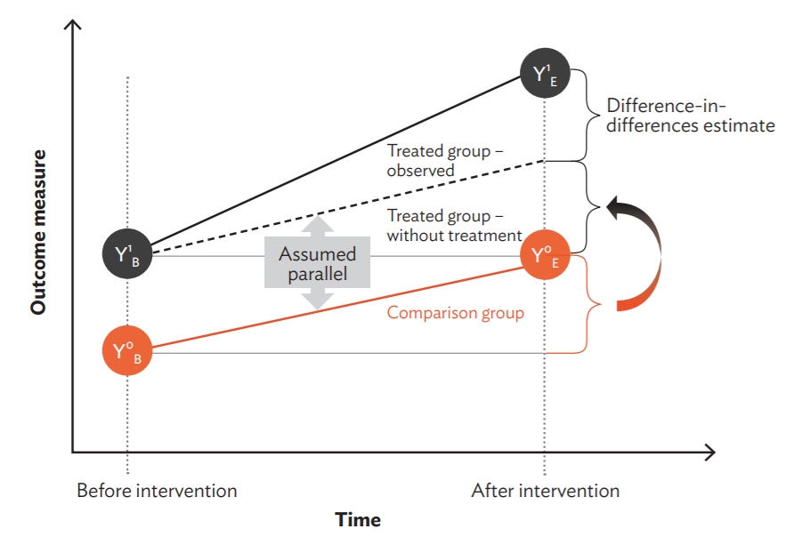
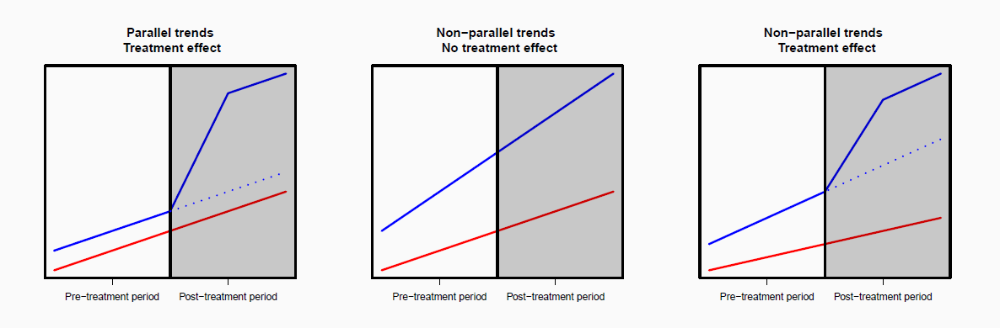

```{r, echo=FALSE, message=FALSE, warning=FALSE}
setwd("C:/Users/bpu058246/Desktop/Teaching/Econometria/Lectures/")
```


class: center, middle, inverse

# **Difference-in-Differences**


---

<br />

<br />


<iframe width="800" height="400" src="https://www.youtube.com/embed/eiffOVbYvNc" frameborder="0" allow="accelerometer; autoplay; encrypted-media; gyroscope; picture-in-picture" allowfullscreen></iframe>

<div class="navy" align="center">
Marginal Revolution University 
</div>

<div class="navy" align="center">
31 August, 2020
</div>

---

## What is Difference in differences (DiD)?

- Difference in differences (DiD) is a quasi-experimental design that makes use of longitudinal data from treatment and control groups to obtain an appropriate counterfactual to estimate a causal effect.

>  A quasi-experimental design is an experimental design without a true randomization process.

- Typically used to estimate the effect of a specific intervention or treatment (such as a passage of law, enactment of policy, or large-scale program implementation)

---

## Setup

- .content-box-purple[.font80[Two groups:]] 

    - $D_i=1$ Treated units
    
    - $D_i=0$ Control units

- .content-box-purple[.font80[Two periods:]] 

    - $T_i=1$ Pre-Treatment period 
    
    - $T_i=0$ Post-Treatment period

- .content-box-purple[.font80[Potential outcome:]] 

    - $Y_{i}^1(t)$ outcome of unit $i$ in period $t$ when treated (at $D_i = 1$)

    - $Y_{i}^0(t)$ outcome of unit $i$ in period $t$ when control (at $D_i = 0$)
    
---

## Setup

.content-box-purple[.font80[Causal effect for unit $i$ at time $t$ is:]] 

- $\tau_i(t) = Y_{i}^1(t) - Y_{i}^0(t)$

For a given unit, in a given time period, the observed outcome $Y_{i}(t)$ is:

-  $Y_{i}(t) = Y_{i}^1(t)\times D_i(t) + Y_{i}^0(t)\times (1-D_i(t))$

-  If treatment occurs only after $t= 0$ we have:

$$Y_{i}(1) = Y_{i}^0(1)\times (1-D_i) + Y_{i}^1(1)\times D_i$$

**Fundamental problem of causal inference:**

.content-box-purple[.font80[Estimand (ATT)]]: $\hat \tau_{ATT} = E[Y_{i}^1(1) - Y_{i}^0(1)|D_i = 1]$

**Missing potential outcome: $E[Y_{0i}(1)|D_i = 1]$, ie. what is the average post-period outcome for the treated in the absence of the treatment?**

---

## Illustration

<div align="center">

</div>

Source: Figure 5.1, White and Raitzer (2018), Impact Evaluation of Development Interventions: A Practical Guide.


---

## Identification Assumptions


<br />

- Parellel trends

    - If treated units did not receive the treatment, they would have followed the same trend as the control units 

    - Trend over time is the same for treatment and control.

- No time-varying confounders 

    - Selection bias is stable over time

    - Omitted variables related both to treatment and outcome must be fixed over time
    
    - e.g., new events after treatment
    
- Composition of the treatment and the control group much be constant

---

.content-box-purple[.font80[Estimand (ATT)]]: $\hat \tau_{ATT} = E[Y_{i}^1(1) - Y_{i}^0(1)|D_i = 1]$

.content-box-purple[.font80[Identification Assumption]] 

- $E[Y_{i}^0(1) - Y_{i}^0(0)|D_i = 1] = E[Y_{i}^0(1) - Y_{i}^0(0)|D_i = 0]$

.content-box-purple[.font80[Identification Result]] 

$$\begin{aligned}
E[Y_{i}^1(1) - Y_{i}^0(1)|D_i = 1] & = E[Y_{i}^1(1)|D_i = 1] - E[Y_{i}^0(1)|D_i = 1]  \\
& = E[Y_{i}^1(1)|D_i = 1] - \{E[Y_{i}^0(0)|D_i = 1]  \\
& + E[Y_{i}^0(1)|D_i = 0] - E[Y_{i}^0(0)|D_i = 0]\}  \\
& = \{E[Y_{i}(1)|D_i = 1] - E[Y_{i}(1)|D_i = 0]\}  \\
& - \{E[Y_{i}(0)|D_i = 1] - E[Y_{i}(0)|D_i = 0]\}
\end{aligned}$$

In other words:

$\hat \tau_{ATT}$ = {Difference in means in post-treatment period} - {Difference in means in pre-treatment period}

---

## Regression DD

Alternatively, the same estimator can be obtained using regression techniques

$$Y_i = \alpha + \beta_1 \times D_i + \beta_2 \times T_i + \delta \times (D_i \times T_i) + \varepsilon$$

where $E[\varepsilon |D_i, T_i] = 0$.

Then, it is easy to show $E[Y_i| {D_i, T_i}]$ in the following table

|  |  $T_i = 0$ |  $T_i = 1$ | After - Before| 
| :--- | :--- | :--- |  :--- |  
| $D_i = 0$  | $\alpha$  | $\alpha + \beta_2$  | $\beta_2$  | 
| $D_i = 1$  | $\alpha + \beta_1$ | $\alpha + \beta_1 + \beta_2 + \delta$ | $\beta_2 + \delta$ | 
| Treated - Control  | $\beta_1$ | $\beta_1 + \delta$ | $\delta$ | 

Thus, the difference-in-differences estimate is given by: $\hat \tau_{ATT} = (\beta_2 + \delta)- \beta_2 = \delta$

Equivalently: $\hat \tau_{ATT} = (\beta_1 + \delta)- \beta_1 = \delta$

---

## Cross-Sectional Regression Estimator


<br />

A nice feature of diff-in-diff is that it does not require panel data, i.e. repeated observations of the same units. But it's also possible to use repeated cross-sections.

- $Y_{igt}$ where unit $i$ is only measured at one $t$

- Units fall into treatment based on groups $g$

- Particularly useful as many "treatments" vary at some aggregate level:

    - e.g. Law changes at the state/region level
    
---

## Cross-Sectional Regression Estimator


<br />

Two options:

.content-box-purple[.font80[Individual-level data:]] 

$$Y_{igt} = \alpha + \beta_1 \times D_{g(i)} + \beta_2 \times T_{t(i)} + \delta \times (D_{g(i)} \times T_{t(i)}) + \varepsilon_{igt}$$

.content-box-purple[.font80[Aggregated data:]] 

$$Y_{gt} = \alpha + \beta_1 \times D_g + \beta_2 \times T_t + \delta \times (D_g \times T_t) + \varepsilon_{gt}$$

Both approaches will give the same result, as the treatment only varies at the group level (so long as the aggregated version is weighted by cell size).

---

## Regression Estimator Advantages

- Easy to calculate standard errors (though be careful about clustering)

- We can control for other variables

    - Individual-level data, group-level treatment: controlling for individual covariates may increase precision
    
    - Time-varying covariates at the group-level may strengthen the parallel trends assumption, but beware of post-treatment bias

- Simple to extend to multiple groups/periods (more on this later)

- Possible to use multi-valued (not just binary) treatments

---

## First Differences Estimator

<br \>

With panel data we can use regression with first differences:

$$\Delta Y_{i} = \alpha + \delta \times D_i + X_i^{'} \beta + \mu, $$

where $\Delta Y_{i} = Y_{i}(1) - Y_{i}(0)$.

<br \>

With two periods it gives identical result as other regressions

---

## Threats to Validity

- Non-parallel trends

    - Critical identification assumption: treatment units have similar trends to control units in the absence of treatment.
    
    - This assumption is however untestable because we cannot observe potential outcome under the control condition for treated units in the post-treatment period.
    
- Potential violations of parallel trends

    - “Ashenfelter’s Dip”: Participants in worker training programs may experience decreased earnings before they enter the program (why are they participating?)
    
    - Targeting: Policymakers may target units who are most improving
    
    
---

## Threats to Validity

.content-box-purple[.font80[Assessing (non-)parallel trends]] 

- One treatment/control group

    - Plot results and look at trends in periods before the treatment
    
    - Is the parallel trends assumption plausible?

- Multiple treatment/control comparisons

    - Estimate treatment effects at different time points (i.e. placebo tests) --> All estimated treatment effects before the treatment should be 0.
    
    - Include unit-specific time trends --> ‘relax’ parallel trends assumption

---

<br \>

<br \>


<div align="center">

</div>


---

## Fixed-Effect Estimator

We can generalise to multiple groups/time periods using unit and period fixed-effects ("two-way" fixed-effect model):

$$Y_{it} = \gamma_i + \alpha_t + \delta D_{it} + \varepsilon_{it}$$

- $\gamma_i$ is a fixed-effect for groups (dummy for each group)

- $\alpha_t$ is a fixed-effect for time periods (dummy for each time period)

- $\delta$ is the diff-in-diff estimate based on $D_{it}$, which is 1 for treated unit-period observations, and 0 otherwise

This is very flexble:

- can replace $D_{it}$ with almost any type of treatment (not only binary)

- can extend easily to multiple periods (i.e. more than 2)

- can have different units treated at different times

---

## Why Fixed-Effect Estimator?

- Unit/group FEs mean that we are only using within group variation in Y to calculate the effect of D

    - Removes any omitted variable bias that is constant over time
    
- Time FEs means that we remove the effect of any changes to the outcome variable that affect all units at the same time

- Note that unit dummies lead to smaller standard errors on our treatment effect. Why not always use unit dummies?

    - Fine in panel data, as we have same units at several points in time

    - Not possible with repeated cross-section when we do not have the
same units in each time period


---

## Standard Errors for DiD

- Many papers using a DiD strategy use data from many periods

- Treatments typically vary at the group level, while outcomes normally measured at the individual level

    - E.g. Minimum wage increases (state-level) and employment data (firm-level) in Card and Krueger (1994)
    
- This will not bias treatment effect estimates, but will cause problems for variance estimation when errors are serially correlated

- Implication: traditional standard errors will tend to be too small.

.content-box-purple[.font80[Solution: Bertrand et al (2004)]] 

Use cluster-robust standard errors where clusters are defined at the level of the treatment. If the number of groups is:

- large (more than 30), use vcovCL in sandwich
- small (less than 30), use block-bootstrap

---

## Data Requirements for DiD

.content-box-purple[.font80[Data structure:]] 


- Panel data or repeated cross-section

- Single or multiple treatments

- Continuous or binary treatments

- Works both at individual/aggregate level


.content-box-purple[.font80[Does this require more data?]] 


- Adding a time dimension can increase the amount of data you need

- No need to control for extensive covariates (so long as they are fixed within units over time) which might mean decreased data collection


---

## Examples of DiD Design

**[Card & Krueger, 1994](http://davidcard.berkeley.edu/papers/njmin-aer.pdf)**

- RQ: Do increases in the minimum wage reduce employment?

- Outcome: Employment growth in fast-food restaurants

- Treatment: Increased minimum wage in New Jersey; no change in Pennsylvania

- Time: Before/after minimum wage changed

- Replication: See course materials

---

## Examples of DiD Design

**[Dinas et al., 2019](https://www.cambridge.org/core/journals/political-analysis/article/waking-up-the-golden-dawn-does-exposure-to-the-refugee-crisis-increase-support-for-extremeright-parties/C50A127CC517968F2D0FA42A2A23FF85)**

- RQ: What is the effect of refugee arrivals on support for the far right?

- Outcome: Municipal support for far right party

- Treatment: Refugee arrivals in Greek islands

- Time: Elections before/after refugee crisis

- [Replication files](https://dataverse.harvard.edu/dataset.xhtml;jsessionid=dfb24d167ac24aa116119011609f?persistentId=doi%3A10.7910%2FDVN%2F3IWTGB&version=&q=&fileTypeGroupFacet=&fileAccess=&fileSortField=size)


---

## Examples of DiD Design

**[Bechtel & Heinmueller, 2011](https://web.stanford.edu/~jhain/Paper/AJPS2011.pdf)**

- RQ: What is the effect of good policy on government support?

- Outcome: Support for the German SPD in parliamentary constituencies

- Treatment: Flooded German regions close to the River Elbe

- Time: Elections before/after 2002, when the Elbe flooded

- [Replication files](https://dataverse.harvard.edu/dataset.xhtml?persistentId=doi:10.7910/DVN/25582)

---

## Examples of DiD Design

**[Hainmueller & Hangartner, 2019](https://onlinelibrary.wiley.com/doi/pdf/10.1111/ajps.12433)**

- RQ: What is the effect of direct democracy on immigrant assimilation?

- Outcome: Naturalization rate of immigrants in Swiss municipalities

- Treatment: Whether municipality decides on naturalisation requests via expert or citizen councils

- Time: Decisions before/after legal changes to decision making in municipalities

- [Replication files](https://dataverse.harvard.edu/dataset.xhtml?persistentId=doi:10.7910/DVN/T8OYHT)


---

## Conclusion


- DiD is very widely used, as it is a powerful conditioning strategy that doesn’t require endless lists of covariates to strengthen the identifying assumption.

- The DiD design allows for a comparison over time in the treatment group, controlling for concurrent time trends using a control group.

- The identification assumption that treatment and control units would follow parallel trends in the absense of treatment is key and should be investigated carefully.

- DiD requires data on multiple units in multiple periods, but can be applied to panel data or repeated cross-sectional data.

