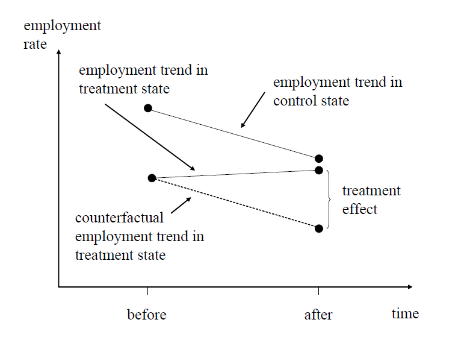

```{r setup, include=FALSE}
require("knitr")
knitr::opts_chunk$set(echo = TRUE)
## setting working directory
opts_knit$set(root.dir = "C:/Users/bpu058246/Desktop/Teaching/Econometria/Lectures/Data/")
```


<br />

## A Replication of “Wage Goes Up, Employment Goes Down?" by Card and Krueger (1994)

<br />

In a perfectly competitive market, conventional economic theory predicts an increase in the minimum wage leads to a rise in unemployment. But cross-sectional studies provide conflicting evidence but not a causal effect. Card and Krueger (1994, 2000) adopt a DID approach and find no vidence that the rise in the minimum  wage leads to higher unemployment. In this exercise, we will replicate Card and Krueger’s paper in R with step-to-step explanations.

### Background

In this exercise, we will reproduce the a famous minimum wage study of Card and Krueger (1994). This was a famous study primarily because of its use of an **explicit counterfactual** for estimation. Card and Krueger (1994) were interested in the effect of minimum wages on employment. Their strategy was to do a simple DD between **two neighboring states**. New Jersey was set to experience an increase in the state minimum wage from $4.25 to $5.05, but neighboring Pennsylvania’s minimum wage was staying at $4.25. They surveyed about 400 fast food stores both in New Jersey and Pennsylvania before and after the minimum wage increase. This was used to measure the outcomes they cared about (i.e., employment).

*“On April 1, 1992, New Jersey’s minimum wage rose from $4.25 to $5.05 per hour. To evaluate the impact of the law we surveyed 410 fast-food restaurants in New Jersey and eastern Pennsylvania before and after the rise. Comparisons of employment growth at stores in New Jersey and Pennsylvania (where the minimum wage was constant) provide simple estimates of the effect of the higher minimum wage. We also compare employment changes at stores in New Jersey that were initially paying high wages (above $5) to the changes at lower-wage stores. We find no indication that the rise in the minimum wage reduced employment.”*

### Research Design

#### **Quasi-Experiment**

Difference in differences (DiD) is a quasi-experimental design that makes use of longitudinal data from treatment and control groups to obtain an appropriate counterfactual to estimate a causal effect. DID is typically used to estimate the effect of a specific intervention or treatment Di (such as a passage of law, enactment of policy, or large-scale program implementation) by comparing the changes in outcomes Yi (e.g. wages, health, etc.) over time between a population that is enrolled in a program (the intervention group) and a population that is not (the control group). 

A quasi-experimental design is an experimental design without a true randomization process. Due to the lack of a random assignment, the treatment and control groups are not equivalent before the intervention. So, any differences from these two groups could be caused by the pre-existing differences. The quasi design has been well received by policy analysts, health care providers, and Direct-To-Consumer companies (in particular, Netflix and Airbnb).

Here are the reasons why we run quasi design:

**1 New Jersey and Pennsylvania are not comparable in a lot of aspects.** 

**2 The legislative process isn’t random.**

Note that a quasi-experiment design does not require equivalent groups!


#### **Notations**

**Treatment**: Change in minimum wage (4.25 to 5.05) on April 1, 1992 (in New Jersey)

**Outcome**: Employment

Let $D$ represent whether it receives the treatment, $T$ for the time, $i$ for the number of research subjects.

$D_i = 1$: New Jersey receives the treatment (minimum wage increase)
$D_i = 0$: Pennsylvania does not receive the treatment
$T = 1$: After the wage increase (1992 November and December)
$T = 0$: Before the wage increase (1992 February and March)
$Y$: the outcome variable (unemployment rate)

Ideally, we would like to know how the treatment group (New Jersey) would behave if they would have not received the treatment, but we don't. The DID approach can solve this issue assuming parallel trends. The Parallel Trends Assumption means the difference between the treatment and control groups would stay constant if there were no treatment. In this case, the differences between the employment rates in NJ and PA would be the same if there were no wage increase law.


<div align="center">

</div>

<div align="center">
Source: Angrist abd Pischke (2008), Chapter 5
</div>

You can simply calculate these means by hand, i.e. obtain the mean outcome of group A in both periods and take their difference. Then obtain the mean outcome of group B in both periods and take their difference. Then take the difference in the differences and that’s the treatment effect.

However, it is more convenient to do this in a regression framework because this allows you

- to control for covariates
- to obtain standard errors for the treatment effect to see if it is significant


Now let's check the data and run the DiD to see if it is the case.


### R codes

We start by importing the dataset and labelling the variables.

```{r include=TRUE, warning = FALSE, message=FALSE}
library(haven) # import stata file
library(expss) # apply labels
data <- read_dta("CK1994_treated.dta")
data = apply_labels(data,
                      y_ft_employment_before = "Full time equivalent employment before treatment",
                      y_ft_employment_after = "Full time equivalent employment after treatment",
                      d_nj ="1 if New Jersey; 0 if Pennsylvania (treatment variable)",
                      x_co_owned ="If owned by company = 1",
                      x_southern_nj = "If in southern NJ = 1",
                      x_central_nj = "If in central NJ = 1",
                      x_northeast_philadelphia = "If in Pennsylvania, northeast suburbs of Philadelphia = 1",
                      x_easton_philadelphia = "If in Pennsylvania, Easton = 1",
                      x_st_wage_before = "Starting wage ($/hr) before treatment",
                      x_st_wage_after ="Starting wage ($/hr) after treatment",
                      x_burgerking ="If Burgerking = 1",
                      x_kfc ="If KFC = 1",
                      x_roys ="If Roys = 1",
                      x_wendys ="If Wendys = 1",
                      x_closed_permanently ="Closed permanently after treatment"

)


```


We then generate the descriptive statistics:


```{r include=TRUE, warning = FALSE, message=FALSE}
library(stargazer)
stargazer(as.data.frame(data), type = "text")
```

Now reproducing Figure 1 (p.777).


```{r include=TRUE, warning = FALSE, message=FALSE}
library(plotly)
#FIGURE 1
  x_st_wage_before_nj <- 
  data$x_st_wage_before[data$d_nj == 1]
  x_st_wage_before_pa <- 
    data$x_st_wage_before[data$d_pa == 1]

# Make a stacked bar plot - Plotly
# Set histogram bins
  xbins <- list(start=4.20, end=5.60, size=0.1)
  
# Plotly histogram  
  p1 <- plot_ly(alpha = 0.6) %>%
    add_histogram(x = x_st_wage_before_nj, 
                  xbins = xbins,
                  histnorm = "percent", 
                  name = "Wage Before (New Jersey)") %>%
    add_histogram(x = x_st_wage_before_pa, 
                  xbins = xbins,
                  histnorm = "percent",
                  name = "Wage Before (Pennsylvania)") %>%
    layout(barmode = "group", title = "February 1992",
           xaxis = list(tickvals=seq(4.25, 5.55, 0.1),
                        title = "Wage in $ per hour"),
           yaxis = list(range = c(0, 50)),
                      margin = list(b = 100, 
                          l = 80, 
                          r = 80, 
                          t = 80, 
                          pad = 0, 
                          autoexpand = TRUE))
  p1
```


```{r include=TRUE, warning = FALSE, message=FALSE}
# WAGE AFTEER
  x_st_wage_after_nj <- 
  data$x_st_wage_after[data$d_nj == 1]
  x_st_wage_after_pa <- 
    data$x_st_wage_after[data$d_pa == 1]

# Make a stacked bar plot - Plotly
  xbins <- list(start=4.20,
                end=5.60,
                size=0.1)
  p2 <- plot_ly(alpha = 0.6) %>%
    add_histogram(x = x_st_wage_after_nj, 
                  xbins = xbins,
                  histnorm = "percent", 
                  name = "Wage After (New Jersey)") %>%
    add_histogram(x = x_st_wage_after_pa, 
                  xbins = xbins,
                  histnorm = "percent",
                  name = "Wage After (Pennsylvania)") %>%
    layout(barmode = "group", title = "November 1992",
           xaxis = list(tickvals=seq(4.25, 5.55, 0.1),
                        title = "Wage in $ per hour"),
             yaxis = list(range = c(0, 100)),
           margin = list(b = 100, 
                          l = 80, 
                          r = 80, 
                          t = 80, 
                          pad = 0, 
                          autoexpand = TRUE))
  p2
  
  
```


<br />

Now we present mean comparisons of the outcome variable.

First, we calculate FTE employment in Pennsylvania and New Jersey before a minimum wage increase.

```{r include=TRUE, warning = FALSE, message=FALSE}
library(dplyr)
library(kableExtra)
# Table 3: Column 1-3, Row 1 (from left to right)

# 1st row: MEANs and SEs across subgroups
  results <- data %>% group_by(d_nj) %>% # group_by the treatment variable
    dplyr::select(d_nj, y_ft_employment_before) %>% # only keep variabel of interest
    summarise(n = sum(!is.na(y_ft_employment_before)), mean = mean(y_ft_employment_before, na.rm = T), var = round(var(y_ft_employment_before, na.rm = T))) %>%
    mutate(se = sqrt(var/n))

# Add row with differences
  results <- bind_rows(results, results[2,]-results[1,])
  
  results$group<- c("PA", "NJ", "NJ-PA")

  diff_se <- sqrt(results$var[1]/results$n[1] + results$var[2]/results$n[2])
  results[3,5]<-diff_se
  
  #print(results)
  
  results_nj<-results%>%
    dplyr::select(mean, se) %>% 
    mutate(mean2 = round(mean, 2), se2 = round(se, 2)) %>%
    dplyr::select(mean2, se2) %>% 
    rename(emp_before=mean2, se =se2)
  
  results_nj_t <- t(results_nj)
  
  print(results_nj_t)
  
```

We then calculate FTE employment in Pennsylvania and New Jersey after a minimum wage increase.

```{r eval=FALSE}
# 2nd row: MEANs and SEs across subgroups
  results2 <- data %>% group_by(d_nj) %>% # group_by the treatment variable
    dplyr::select(d_nj, y_ft_employment_after) %>% # only keep variabel of interest
    summarise(n = sum(!is.na(y_ft_employment_after)), mean = mean(y_ft_employment_after, na.rm = T), var = round(var(y_ft_employment_after, na.rm = T))) %>%
    mutate(se = sqrt(var/n))

# Add row with differences
  results2 <- bind_rows(results2, results2[2,]-results2[1,])
  
  results2$group<- c("PA", "NJ", "NJ-PA")

  diff_se <- sqrt(results2$var[1]/results2$n[1] + results2$var[2]/results2$n[2])
  results2[3,5]<-diff_se
  
  #print(results2)
  
  results2_pa<-results2%>%
    dplyr::select(mean, se) %>% 
    mutate(mean2 = round(mean, 2), se2 = round(se, 2)) %>%
    dplyr::select(mean2, se2) %>% 
    rename(emp_after=mean2, se =se2)
  
  results2_pa_t <- t(results2_pa)
  print(results2_pa_t)

```

The effect of a minimum wage increase on employment: 

```{r eval=FALSE}
results_t<-rbind(results_nj_t, results2_pa_t)
results_all <- results_t[3,]-results_t[1,]
print(results_all)
```

A slightly different approach using dplyr

```{r include=TRUE, warning = FALSE, message=FALSE}
data %>% group_by(d_nj) %>% 
  summarise(mean.before = round(mean(y_ft_employment_before, na.rm=TRUE),2),
            mean.after = round(mean(y_ft_employment_after, na.rm=TRUE),2),
            var.before = round(var(y_ft_employment_before, na.rm=TRUE),2),
            var.after = round(var(y_ft_employment_after, na.rm=TRUE),2),
            n.before = sum(!is.na(y_ft_employment_before)),
            n.after = sum(!is.na(y_ft_employment_after))) %>%
                mutate(se.mean.before = round(sqrt(var.before/n.before),2)) %>%
                mutate(se.mean.after = round(sqrt(var.after/n.after),2))
```


To reproduce columns (1) & (2) of Table 4 (p. 780), first we select the data for analysis.

```{r include=TRUE, warning = FALSE, message=FALSE}
data2 <- dplyr::select(data, 
                         y_ft_employment_after,
                         y_ft_employment_before,
                         d_nj,
                         x_burgerking,
                         x_kfc,
                         x_roys,
                         x_co_owned,
                         x_st_wage_before,
                         x_st_wage_after,
                         x_closed_permanently,
                         x_southern_nj,
                         x_central_nj,
                         x_northeast_philadelphia,
                         x_easton_philadelphia) %>%
           mutate(x_st_wage_after = case_when(x_closed_permanently == 1 ~ NA_character_, # these stores get an NA
                                              TRUE ~ as.character(x_st_wage_after)),
                  x_st_wage_after = as.numeric(x_st_wage_after)) %>%
                  na.omit()
```

Now we can fit the differences-in-difference model.

```{r include=TRUE, warning = FALSE, message=FALSE}
# Model (i)/Column 1: Try by yourself
fit1 <- lm((y_ft_employment_after-y_ft_employment_before) ~ 
             d_nj, 
           data = data2)
# Model (ii)/Column 2: Controls Chain/Ownership
fit2 <- lm((y_ft_employment_after-y_ft_employment_before) ~ 
             d_nj + x_burgerking + x_kfc + x_roys + x_co_owned, 
           data = data2)
stargazer(fit1, fit2, type="text", digits=2)
```


<br />

## Discussion

DiD is a method to estimate treatment effects with non-experimental data. That’s the most useful feature. DiD is also a version of fixed effects estimation. Whereas the fixed effects model makes assumption at the individual level, DiD makes a similar assumption but at the group level. So the expected value of the outcome here is the sum of a group and a time effect. So what’s the difference? For DiD you don’t necessarily need panel data as long as your repeated cross sections are drawn from the same aggregate unit. This makes DiD applicable to a wider array of data than the standard fixed effects models that require panel data.

The most important assumption in DiD is the **parallel trends assumption** (see the figure above). Never trust a study that does not graphically show these trends! Papers in the 1990s might have gotten away with this but nowadays our understanding of DiD is much better. If there is no convincing graph that shows the parallel trends in the pre-treatment outcomes for the treatment and control groups, be cautious. If the parallel trends assumption holds and we can credibly rule out any other time-variant changes that may confound the treatment, then DiD is a trustworthy method. 

Another word of caution should be applied when it comes to the treatment of standard errors. With many years of data you need to **adjust the standard errors for autocorrelation**. In the past, this has been neglected but since Bertrand et al. (2004) “How Much Should We Trust Differences-In-Differences Estimates?” we know that this is an issue. In the paper they provide several remedies for dealing with autocorrelation. The easiest is to cluster on the individual panel identifier which allows for arbitrary correlation of the residuals among individual time series. This corrects for both autocorrelation and heteroscedasticity.


<br />
