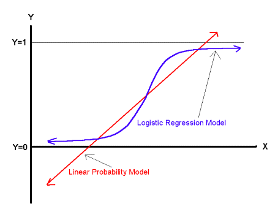
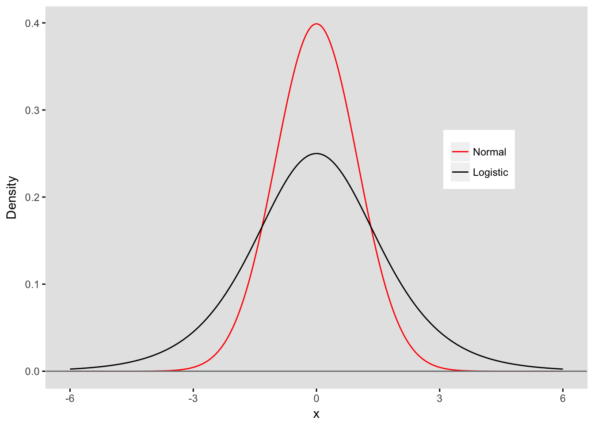
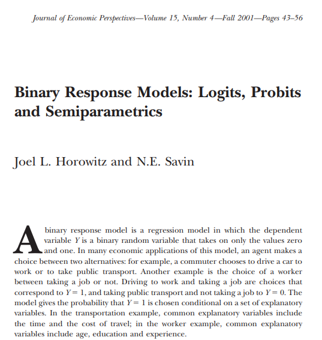
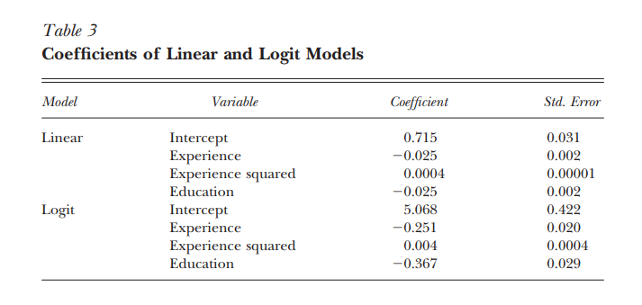
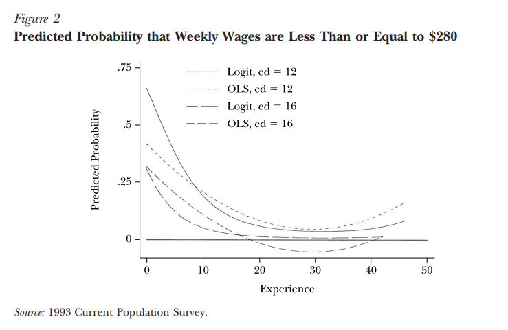
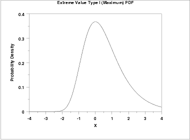

```{r, echo=FALSE, message=FALSE, warning=FALSE}
setwd("C:/Users/bpu058246/Desktop/Teaching/Econometria/Lectures/")
```


class: center, middle, inverse

# **Models with Limited Dependent Variables**

---

#  Examples

- Binary Choice

    - Do you apply to graduate programs? [if yes, then y = 1; if no, then y = 0]

- Ordered Choice

    - Products star rating
    
    - Bond ratings [AAA, AA, A, ..., Junk]
    
    - Likert scale questions

- Truncated Choice

    - Smoking  [if no, then y = 0; if yes, then y = 1# packs per week]
    
- Discret choice

    - Transportation to work [car, bus, metro, bike, walk, telecommute]

---

# Binary Choice Models

<br />

- We want to explain a binary outcome (yes or no), indicated by $y=1$ or $y=0$

- Mostly based on cross-section data. Examples: 

	- individual labour supply
decision
	- firms FDI decisions, 
	- renting or owning a house, etc.

- Sometimes time-series data, e.g. is there a recession (next quarter)?

- Models amount to specifying the probability that $y=1$ as a function of $\mathbf{x}$

---

# The Linear Probability Model

- A linear model could be written as
\begin{equation*}
y_{i}=\mathbf{x}_{i}^{\prime}\boldsymbol{\beta}+\varepsilon_{i}
\end{equation*}
where $\mathbf{x}_{i}$ is a $k$-column vector of explanatory variables (including a constant)

- Assuming that $E(\varepsilon_{i}|\mathbf{x}_{i})=0$ implies
\begin{equation*}
E\left( y_{i}|\mathbf{x}_{i}\right) =\mathbf{x}_{i}^{\prime }\boldsymbol{\beta}
\end{equation*}
and
\begin{equation*}
P\left( y_{i}=1|\mathbf{x}_{i}\right) =\mathbf{x}_{i}^{\prime}\boldsymbol{\beta}
\end{equation*}

---

# The Linear Probability Model

- Probabilities may be outside the $[0,1]$ interval and it could give wrong magnitude of the marginal effects close to boundaries

- The error terms are heteroskedastic
\begin{equation*}
V\left(\varepsilon_{i}|\mathbf{x}_{i}\right) =\mathbf{x}_{i}^{\prime}
\boldsymbol{\beta}(1\mathbf{-\mathbf{x}_{i}^{\prime }\boldsymbol{\beta})}
\end{equation*}

- The model can be estimated by OLS with heteroskedasticity-consistent (White) standard errors

- But probability may still be outside the $[0,1]$ interval

- There are better alternatives


---

# Binary Choice Models

- Model assumptions are analogous to the OLS model

    - Model is correctly specified
    
    - Random sample from the population
    
    - Conditional variaion in each explanatory variables
    
    - Zero conditional mean
    
    - Homoskedasticity
    
    - Asumption about the error distribution (e.g., normal, logistic)
    
- Goal: Lean how $x_1, x_2, ..., x_k$ affect probability of making a choice

- Simplifying notation:

    - Let $X \beta = \beta_0 + \beta_1 x_1 + \beta_2 x_2 + ... + \beta_k x_k$
    
    - Let $X = 1, x_1, x_2, ..., x_k$


---

# Binary Choice Models

- Binary choice models assume
\begin{equation*}
P\left( y_{i}=1|\mathbf{x}_{i}\right) =F(\mathbf{x}_{i}^{\prime}\boldsymbol{\beta)}
\end{equation*}

- $F(\mathbf{.)}$ belongs to $[0,1]$ and is monotonic

- [cumulative distribution functions](https://en.wikipedia.org/wiki/Cumulative_distribution_function) (cdf) are natural candidates

- Common choices are:

	- [Standard normal](https://en.wikipedia.org/wiki/Normal_distribution) cdf (leads to the probit model)
\begin{equation*}
F(\mathbf{x}_{i}^{\prime}\boldsymbol{\beta)=\Phi (\mathbf{x}_{i}^{\prime}
\boldsymbol{\beta})=}\int\nolimits_{-\infty}^{\mathbf{x}_{i}^{\prime }\boldsymbol{\beta}}\frac{1}{\sqrt{2\pi}}\exp \left\{ -\frac{1}{2}t^{2}\right\} dt
\end{equation*}

	- [Logistic](https://en.wikipedia.org/wiki/Logistic_distribution) cdf (leads to the logit model)
\begin{equation*}
F(\mathbf{x}_{i}^{\prime}\boldsymbol{\beta)=}\frac{\exp (\mathbf{x}
_{i}^{\prime}\boldsymbol{\beta})}{1+\exp(\mathbf{x}_{i}^{\prime }\boldsymbol{\beta})}
\end{equation*}

---

# Binary Choice Models

<p align="center">
  
</p>

- $F \rightarrow 0$ as $X \beta \rightarrow - \infty$

- $F \rightarrow 1$ as $X \beta \rightarrow \infty$

---

# Binary Choice Models 

<br />

- Estimates of the coefficients across models are roughly approximated as:


$$\widehat{\boldsymbol{\beta}}_{logit} \simeq  4 \widehat{\boldsymbol{\beta}}_{OLS}$$

$$\widehat{\boldsymbol{\beta}}_{probit} \simeq  2.5 \widehat{\boldsymbol{\beta}}_{OLS}$$

$$\widehat{\boldsymbol{\beta}}_{logit} \simeq  1.6 \widehat{\boldsymbol{\beta}}_{probit}$$


- But marginal effects should be similar


---

# The Latent Variable Motivation

- Both models can be derived from a latent variable equation

- Suppose that
\begin{equation*}
y_{i}^{\ast}=\mathbf{x}_{i}^{\prime}\boldsymbol{\beta}+\varepsilon_{i}
\end{equation*}
where $y_{i}^{\ast}$ is unobserved

- Assume that $y_{i}=1$ if $y_{i}^{\ast}>0$

- The probability of this happening is
\begin{equation*}
P(y_{i}^{\ast}>0|\mathbf{x}_{i})=P(\varepsilon _{i} > - \mathbf{x}
_{i}^{\prime}\boldsymbol{\beta}|\mathbf{x}_{i})=F(\mathbf{x}_{i}^{\prime}\boldsymbol{\beta })
\end{equation*}

- The shape of the $F(.)$ depends on the distribution of $\varepsilon$

    - Probit model: $\varepsilon \thicksim$ standard normal
    
    - Logit model: $\varepsilon \thicksim$ standard logistic
    
    - Logistic and normal distributions are similar (logistic has fatter tails)
    
    
---

# The Latent Variable Motivation


<p align="center">
  
</p>
    

- Scale of the distribution is different. That is why the $\boldsymbol{\beta}$s are not directly comparable


---

# Limitation of OLS

<p align="center">
  
</p>


---

# Limitation of OLS

- Example

Probability that a worker qualifies for social programs

- Data

Current Population Survey earning for 3123 full-time white male workers employed in the North-Central region of the US

- Goal

Model the probability that a worker's wage is below $280 per week, given their education (edu) and experience (ex)

- Model

$$pr(y =1 | edu, ex) = F(\beta_0 + \beta_1 edu + \beta_2 ex + \beta_3 ex^2)$$


---

# Limitation of OLS

<br />

- **Question: How do we choose the F() function?**


- Specification 1: Linear Probability Model

    - $pr(y =1 | edu, ex) = \beta_0 + \beta_1 edu + \beta_2 ex + \beta_3 ex^2$
    
    - Estimate using OLS
    
- Specification 2: Logit Model   

    - $pr(y =1 | edu, ex) = \frac{exp(\beta_0 + \beta_1 edu + \beta_2 ex + \beta_3 ex^2)}{1+exp(\beta_0 + \beta_1 edu + \beta_2 ex + \beta_3 ex^2)}$
    
    - Estimate using maximum likelihood
    
---

# Limitation of OLS

<p align="center">
  
</p>


- Linear Probability Model: $pr(y =1 | edu, ex) = \beta_0 + \beta_1 edu + \beta_2 ex + \beta_3 ex^2$

- Logit Model: $pr(y =1 | edu, ex) = \frac{exp(\beta_0 + \beta_1 edu + \beta_2 ex + \beta_3 ex^2)}{1+exp(\beta_0 + \beta_1 edu + \beta_2 ex + \beta_3 ex^2)}$


---

# Limitation of OLS

<p align="center">
  
</p>


- Linear Probability Model: $pr(y =1 | edu, ex) = \beta_0 + \beta_1 edu + \beta_2 ex + \beta_3 ex^2$

- Logit Model: $pr(y =1 | edu, ex) = \frac{exp(\beta_0 + \beta_1 edu + \beta_2 ex + \beta_3 ex^2)}{1+exp(\beta_0 + \beta_1 edu + \beta_2 ex + \beta_3 ex^2)}$


---

# Interpretation of Binary Models

In the linear regression model, 
\begin{equation*}
y_{i}=\mathbf{x}_{i}^{\prime }\mathbf{\beta +}\varepsilon_{i} 
\end{equation*}

we have
\begin{equation*}
\frac{\partial E(y_{i}|\mathbf{x}_{i})}{\partial x_{k}}=\beta_{k} 
\end{equation*}

Here,
\begin{equation*}
E(y_{i}|\mathbf{x}_{i})=F(\mathbf{x}_{i}^{\prime }\mathbf{\beta )}=\Pr
(y_{i}=1)
\end{equation*}
and thus,
\begin{equation*}
\frac{\partial E(y_{i}|\mathbf{x}_{i})}{\partial x_{k}}=\beta _{k}f(\mathbf{x}_{i}^{\prime }\mathbf{\beta )} 
\end{equation*}
where f(.) is the probability density function (pdf)

---

# Interpretation of Binary Models

**Linear probability model**: constant marginal effect of increasing X

**Binary models**: marginal effect changes with the value of the regressors (this is common
with nonlinear models). 

Three different ways to evaluate the marginal effect:
 
- At the average of the regressors

- As the average of the marginal effects for all observations

- As the marginal effect for a "typical individual"
 
We may want to evaluate the marginal effect in the structural model. For example, in the "latent model" the marginal effect is simply,
\begin{equation*}
\frac{\partial E(y_{i}^{\ast})}{\partial x_{k}}=\beta_{k} 
\end{equation*}

---

# Interpretation of Binary Models

<br />

### **Calculating Marginal Effects**:

\begin{equation*}
P\left( y_{i}=1|\mathbf{x}_{i}\right) = F(\mathbf{x}_{i}^{\prime}\boldsymbol{\beta)=}\frac{\exp (\mathbf{x}
_{i}^{\prime}\boldsymbol{\beta})}{1+\exp(\mathbf{x}_{i}^{\prime }\boldsymbol{\beta})}
\end{equation*}

Example: Suppose P depends on two variables, $x_1$ and $x_2$

- The values of $x_1$ and $x_2$ mater. Let's set $x_2$ at its average: $x_2 = \overline x_2$

- Let's calculate the change in P from increasing $x_1$ from 1 to 2

$$\bigtriangleup P = P\left( y=1|\mathbf{x}_{1} =1, \overline x_2 \right)$$

$$\bigtriangleup P = \frac{\exp (\beta_0 + \beta_12 + \beta_2 \overline x_2)}{1+\exp(\beta_0 + \beta_12 + \beta_2 \overline x_2)}-\frac{\exp (\beta_0 + \beta_1 + \beta_2 \overline x_2)}{1+\exp(\beta_0 + \beta_1 + \beta_2 \overline x_2)}$$

---

# Interpretation of Binary Models

<br />

### **Probit model**:

\begin{equation*}
F(\mathbf{x}_{i}^{\prime}\boldsymbol{\beta)=\Phi (\mathbf{x}_{i}^{\prime}
\boldsymbol{\beta})=}\int\nolimits_{-\infty}^{\mathbf{x}_{i}^{\prime }\boldsymbol{\beta}}\frac{1}{\sqrt{2\pi}}\exp \left\{ -\frac{1}{2}t^{2}\right\} dt
\end{equation*}

- Predicted probabilities range from 0 to 1

- Marginal effects cannot be calculated analytically but can be calculated numerically in econometrics software

- Probit and Logit models tend to produce similar marginal effects

---

# Estimation - MLE

- Binary choice models assume

\begin{equation*}
P = P\left( y_{i}=1|\mathbf{x}_{i}\right) =P(y_{i}^{\ast}>0|\mathbf{x}_{i})=P(\varepsilon _{i} > - \mathbf{x}
_{i}^{\prime}\boldsymbol{\beta}|\mathbf{x}_{i})=F(\mathbf{x}_{i}^{\prime}\boldsymbol{\beta })
\end{equation*}

- The shape of $F(\cdot)$ function depends on the distribution of $\varepsilon$

    - Probit model: $\varepsilon \sim$  normal
    
    - Logit model: $\varepsilon \sim$  logistic
    
- Typically, binary choice models are estimated by maximum likelihood

- Unlike OLS we must know the distribution of the error term to implement maximum likelihood estimation (MLE)

- Intuition for MLE: choose values for $\beta$ that maximize the likelihood of observing the outcomes in your data

---

# Estimation - MLE

- With independent observations, the likelihood function is
\begin{equation*}
L(\boldsymbol{\beta})=\prod\nolimits_{i=1}^{N}\left[ P\left( y_{i}=1|\mathbf{x}_{i};\boldsymbol{\beta}\right) \right] ^{y_{i}}\left[ 1-P\left(y_{i}=1|\mathbf{x}_{i};\boldsymbol{\beta }\right) \right] ^{1-y_{i}}
\end{equation*}
where $P\left(y_{i}=1|\mathbf{x}_{i};\boldsymbol{\beta}\right) =F(\mathbf{x}_{i}^{\prime }\boldsymbol{\beta})$

<br />

- The log-likelihood function (LLF) is
\begin{equation*}
\log L(\boldsymbol{\beta})=\sum\nolimits_{i=1}^{N}y_{i}\log F(\mathbf{x}_{i}^{\prime}\boldsymbol{\beta})+(1-y_{i})\log \left[ 1-F(\mathbf{x}_{i}^{\prime}\boldsymbol{\beta})\right]
\end{equation*}

<br />

- Estimation: choose $\beta$ to maximize LLF


---

# Estimation - MLE

- Prefect predict

1) $y_i = 1 = F(x_i \hat \beta)$; 

2) $y_i = 0 = F(x_i \hat \beta)$ 

$\Longrightarrow \log_i L(\boldsymbol{\hat \beta})= 0$


- Imprefect predict

1) $y_i = 1 > F(x_i \hat \beta)$; 

2) $y_i = 0 < F(x_i \hat \beta)$ 

$\Longrightarrow \log_i L(\boldsymbol{\hat \beta}) < 0$

- So, larger values for LLF imply more accurate predictions for $y_i$

---

# Estimation - MLE

- The ML estimator is the solution to
\begin{equation*}
\frac{\partial \log L(\boldsymbol{\beta })}{\partial \boldsymbol{\beta }}=0
\end{equation*}

- In the case of the logit model we have
\begin{equation*}
\frac{\partial \log L(\boldsymbol{\beta})}{\partial \boldsymbol{\beta }}=\sum\nolimits_{i=1}^{N}\left[ y_{i}-\frac{\exp (\mathbf{x}_{i}^{\prime }
\boldsymbol{\beta})}{1+\exp (\mathbf{x}_{i}^{\prime}\boldsymbol{\beta })}\right] 
\mathbf{x}_{i}=0
\end{equation*}

- To solve for $\boldsymbol{\beta}$ we need to use an iterative algorithm

- Because the log-likelihood is globally concave the Newton-Raphson algorithm usually converges very quickly for logit and probit 

---

# Estimation - MLE

- The MLE is consistent if the conditional density of $y$ given $\mathbf{x}$ is correctly specified, that is
\begin{equation*}
E(y_{i}|\mathbf{x}_{i})=F(\mathbf{x}_{i}^{\prime}\boldsymbol{\beta)} 
\end{equation*}

- Given correct specification
\begin{equation*}
\widehat{\boldsymbol{\beta }}_{ML}\overset{a}{\sim} \mathbf{N}\left( \boldsymbol{\beta},
\left[-E\frac{\partial^{2}\log L}{\partial \boldsymbol{\beta }\partial \boldsymbol{
\beta}^{^{\prime}}}\right] ^{-1}\right) 
\end{equation*}

- Binary outcome models are unusual because robust version of the variance only makes sense if there is clustering (no need to worry about misspecification of the variance)

---

# Estimation - MLE

<br />

- Potential problems that can cause MLE to be biased and inconsistent

    - heteroskedasticity
    
    - nonrandom samples
    
    - violations of the zero conditional mean
    
    - incorrect assumption about model error

---

# Hypothesis Testing & Prediction

<br />

- Hypothesis testing

    - z-test (similar to OLS t-test)
    
    - Wald statistics (similar to OLS F-tests)
    
    - Confidence intervals

- Prediction

    - Yields probabilities that the outcome will be 1

---

# Goodness of Fit

- There is **no single measure for the goodness-of-fit** as in linear regression models

- Let $L_{1}$ denote the value of the log-likelihood at the maximum and $L_{0}$ the value when all parameters (except the constant) are set to $0$

- The pseudo $R^{2}$ is
\begin{equation*}
pseudo \: R^{2}= 1 - \frac {L_1}{L_0}= 1-\frac{1}{1+\frac{2(\log L_{1}-\log L_{0})}{N}}
\end{equation*}

As $L_1$ increases, $L_1 \rightarrow 0$, which implies $\frac {L_1}{L_0} \rightarrow 0$ and $pseudo \: R^{2} \rightarrow 1$

- McFadden $R^{2}$ is
\begin{equation*}
McFadden \:R^{2}=1-\log L_{1}/\log L_{0}
\end{equation*}

- Measures based on the cross-tabulation of actual and predicted values

---

# Ordered Logit and Probit models

- Non-binary outcomes with a clear ordering

- Examples

    - Star ratings for Amazon products, restaurants, UBER hotels, movies
    
    - Bond ratings [AAA, AA, A, ..., Junk]
    
    - Likert scale questions

- Extend binary latent variable framework to $J$ choices:

$$c = X \beta + u$$

$$y = 1 \:  \: if \:  \: - \infty< c \leq \theta_1$$

$$y = 2 \:  \: if \:  \: \theta_1< c \leq \theta_2$$

$$...$$
$$...$$
$$...$$

$$y = J \:  \: if \: \: \theta_{J-1}< c \leq \infty$$


---

# Tobit model

- Outcome variable is truncated (at zero)

y = c if $c = X \beta + u >0$

y = 0 if $c = X \beta + u \leq 0$

- e.g. A central bank intervenes to stop an exchange rate falling below or going above certain levels;

- e.g. Dividends paid by a company may remain zero until earnings reach some threshold value
    
- e.g.  A government imposes price controls on some goods
    
- e.g. College degree separately increases wage and chance of finding a job

  
---

# Tobit model

- Many zeros can create problems for OLS

    - Excluding them ignores extensive margin effects
    
    - Including them mixes intensive and extensive margin effects
  

- Tobit model combines elements of probit and OLS

- Asumptions are similar to A.1-A.6, i.e., $\mu \sim N(0, \sigma^2)$

- $d_i$ =1 if $c_i >0$ so that $y_i$ is observed

- Tobit Log-likelihood function (LLF)

\begin{equation*}
\log L(\boldsymbol{\beta})=\sum\nolimits_{i=1}^{N}(1-d_{i})\log \left[1- \Phi(\frac{X_i \beta}{\sigma}) \right]+d_{i}\log \left[ \frac{1}{\sigma} \Phi(\frac{y_i - X_i \beta}{\sigma}) \right]
\end{equation*}


---

# Conditional Logit model

- Discret set of choices, differentiated by characteristics

- Different agents may rank choices differently

- Examples: cars, cereal, neighborhoods

- Key data features

    - Chocies that were made
    
    - Choices that could have been made but were not made
    
    - prices
    
    - characteristics
    
- Goal: learn decision maker's preferences for choice characteristics

---

# Conditional Logit model

- Random Utility Model (McFadden)

$$V_{ij} = \beta_1x_{1j} + \beta_2x_{2j} + \cdot \cdot \cdot + \beta_kx_{kj} + \varepsilon_{ij} = X_j\beta + \varepsilon_{ij}$$

$i=1, \cdot \cdot \cdot, I$ consumers

$j=1, \cdot \cdot \cdot, J$ choices

$V_{ij} =$ consumer $i$'s utility from choice $j$

$X_{j} =$ characteristics of choice $j$

$\beta =$ preferences for observed choice characteristics

$\varepsilon_{ij} =$ idiosyncratic preferences for choices


---

# Conditional Logit model

- Random Utility Model (McFadden)

$$V_{ij} = \beta_1x_{1j} + \beta_2x_{2j} + \cdot \cdot \cdot + \beta_kx_{kj} + \varepsilon_{ij} = X_j\beta + \varepsilon_{ij}$$

> Interpretation of $\varepsilon_{ij} =$ idiosyncratic preferences for choices

- Unobserved characteristics

- preferences are random

- optimization mistakes

- misspecification of the utility fuction
    
    
---

# Conditional Logit model

- Random Utility Model (McFadden)

$$V_{ij} = \beta_1x_{1j} + \beta_2x_{2j} + \cdot \cdot \cdot + \beta_kx_{kj} + \varepsilon_{ij} = X_j\beta + \varepsilon_{ij}$$

> Assumptions on the choice set

- Mutually exclusive (e.g. ABC = A, B, C, AB, AC, BC, ABC)

- Exhaustive (e.g. A, B, C, none of these)

- Finite (i.e. outcome cannot be chosen continuously)
    
    
---

# Conditional Logit model

- Random Utility Model (McFadden)

$$V_{ij} = \beta_1x_{1j} + \beta_2x_{2j} + \cdot \cdot \cdot + \beta_kx_{kj} + \varepsilon_{ij} = X_j\beta + \varepsilon_{ij}$$

<br />

$$\begin{aligned}
p_{ij} & = prob(j \: maximizes \: utility \: for \: i = prob(V_{ij} > V_{im}, \forall m \neq j)  \\
& = prob(X_j\beta + \varepsilon_{ij} > X_m\beta + \varepsilon_{im}, \forall m \neq j)  \\
& = prob(\varepsilon_{ij} - \varepsilon_{im}> X_m\beta - X_j\beta, \forall m \neq j)
\end{aligned}$$

Assume $\varepsilon_{ij} \sim$ Type I Extreme Value


---

# Conditional Logit model

- Type I Extreme Value Distribution

<p align="center">
  
</p>


- Similar to normal, but skewed

- Key results: if $\varepsilon_{ij} \sim$ Type I Extreme Value, then $\varepsilon_{ij} - \varepsilon_{im} \sim$ logistic

$\Longrightarrow$ This yields a simple expression for choice probabilities

    
    
---

# Conditional Logit model

- Random Utility Model (McFadden)

$$V_{ij} = \beta_1x_{1j} + \beta_2x_{2j} + \cdot \cdot \cdot + \beta_kx_{kj} + \varepsilon_{ij} = X_j\beta + \varepsilon_{ij}$$

<br />

$$\begin{aligned}
p_{ij} & = prob(j \: maximizes \: utility \: for \: i = prob(V_{ij} > V_{im}, \forall m \neq j)  \\
& = prob(X_j\beta + \varepsilon_{ij} > X_m\beta + \varepsilon_{im}, \forall m \neq j)  \\
& = prob(\varepsilon_{ij} - \varepsilon_{im}> X_m\beta - X_j\beta, \forall m \neq j)   \\
& = \frac{exp(X_j\beta)}{\sum_1^Jexp(X_j\beta)}
\end{aligned}$$

---

# Conditional Logit model

- Random Utility Model (McFadden)

$$V_{ij} = \beta_1x_{1j} + \beta_2x_{2j} + \cdot \cdot \cdot + \beta_kx_{kj} + \varepsilon_{ij} = X_j\beta + \varepsilon_{ij}$$

$$p_{ij} = prob(j \: maximizes \: utility \: for \: i = \frac{exp(X_j\beta)}{\sum_1^Jexp(X_j\beta)}$$

- MLE chooses $\beta$'s to match predicted probabilities ($\hat p_j$) to market shares

- Results can be used calculate
 
    - Demand curves
    
    - Welfare measures
    
    - Effects of policies that alter the choice set
 
---

# R packages

`glm`: [Generalized Linear Models](https://stat.ethz.ch/R-manual/R-devel/library/stats/html/glm.html)

```{r eval = FALSE}
# ordered logit model
install.packages(MASS)
library(MASS)
# multinomial logit model
install.packages(nnet)
library(nnet)

# marginal effects
install.packages(mfx)
library(mfx)   
install.packages(erer)
library(erer)
```

---

# R examples

<br />

- [Logit model](https://stats.idre.ucla.edu/r/dae/logit-regression/)

- [Probit model](https://stats.idre.ucla.edu/r/dae/probit-regression/)

- [Ordered Logit model](https://stats.idre.ucla.edu/r/dae/ordinal-logistic-regression/)

- [Tobit model](https://stats.idre.ucla.edu/r/dae/tobit-models/)

- [Multinomial Logit model](https://stats.idre.ucla.edu/r/dae/multinomial-logistic-regression/)
