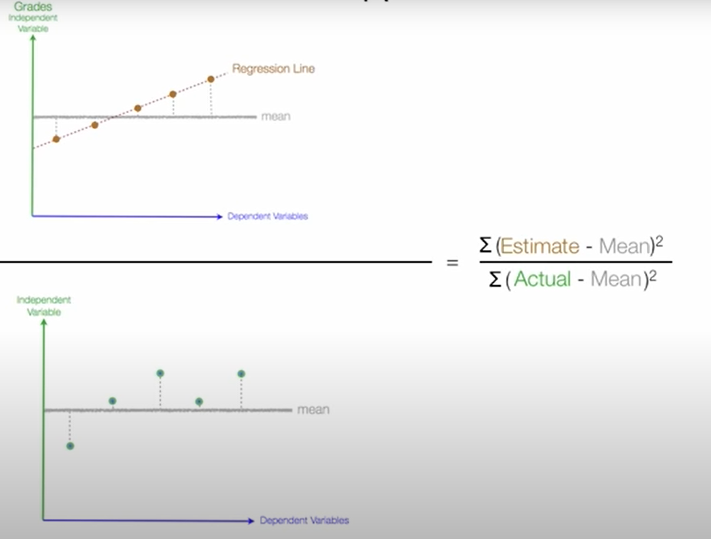
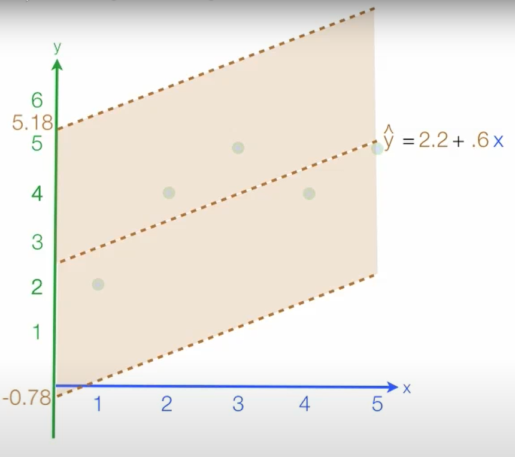
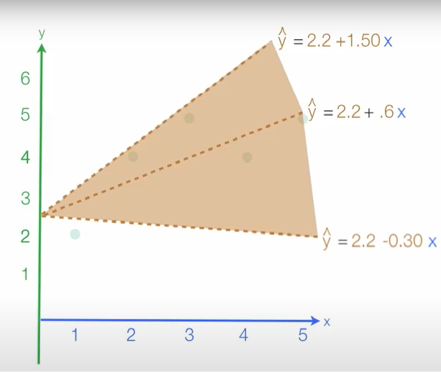
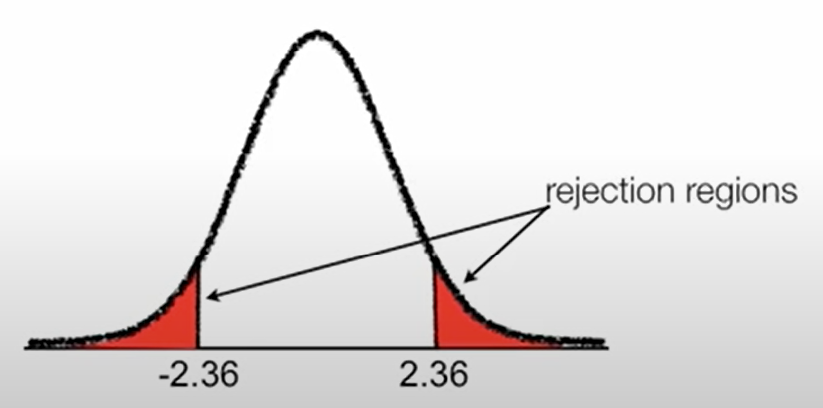

```{r, echo=FALSE, message=FALSE, warning=FALSE}
setwd("C:/Users/bpu058246/Desktop/Teaching/Econometria/Lectures/")
```


class: center, middle, inverse

# **The Linear Regression Model**


---

## A Quick Review

- The linear regression model in combination with the method of ordinary least squares (OLS) is one of the cornerstones of econometrics.

- For each observation *“i”* it is assumed that:

$$y_i=\beta_1+\beta_2 x_{2i}+\beta_3 x_{3i} + ...+\beta_k x_{ki} + \epsilon_i$$ 

- What do all the symbols $(y,\beta, x,. . . etc)$ mean?

- More concisely, 

$$y_i=x_{i}^{'}\beta  + \epsilon_i$$ 
or in matrix terms,

$$y=X\beta  + \epsilon$$ 


---

## A Quick Review

where the matrices are defined as:

$$x_{i}^{'} =
 \begin{bmatrix}
  1&x_{2i} & x_{3i} & \cdots & x_{ki}
 \end{bmatrix}$$
 
 
$$y =
 \begin{bmatrix}
  y_{1} \\
  y_{2} \\
  \vdots \\
  y_{N} 
 \end{bmatrix}$$
 


$$X =
  \begin{bmatrix}
      1 & x_{11} & x_{21} & \dots  & x_{k1} \\
      1 & x_{12} & x_{22} & \dots  & x_{k2} \\
      \vdots & \vdots & \vdots & \ddots & \vdots \\
      1 & x_{1N} & x_{2N} & \dots  & x_{kN}
  \end{bmatrix}$$


---

## A Quick Review

<br />

<br />
 
$$\beta =
 \begin{bmatrix}
  \beta_{1} \\
  \beta_{2} \\
  \vdots \\
  \beta_{k} 
 \end{bmatrix}$$
 


 
$$\epsilon =
 \begin{bmatrix}
  \epsilon_{1} \\
  \epsilon_{2} \\
  \vdots \\
  \epsilon_{N} 
 \end{bmatrix}$$


---

## The Least Squares Solution

- Our mission is to fit the model, which will give us the best estimates for $\beta_1$, $\beta_2$, ..., $\beta_{k}$

- The least squares estimators minimize:

$$Q = \sum_{i=1}^N (y_i-x_{i}^{'}\tilde\beta)^2$$

or

$$Q = \sum_{i=1}^N (y_i - \tilde\beta_{1}-\tilde\beta_{2}x_{2i}-\tilde\beta_{3}x_{3i}-...-\tilde\beta_{k}x_{ki})^2$$

where

$$\beta^{'} =
 \begin{bmatrix}
  \tilde\beta_{1} & \tilde\beta_{2} & \cdots & \tilde\beta_{k}
 \end{bmatrix}$$
 
are values to be chosen
 

---

## The Least Squares Solution

<br />

<br />

- The solution is

$$\hat\beta = b = (X^{'}X)^{-1}X^{'}y$$ 


- The fitted values are given by

$$\hat y_i = x_{i}^{'}b$$


- and the residuals are

$$e_i = y_i - \hat y_i$$


---

## The Least Squares Solution

### Simple Linear Regression


- A simple linear regression is just a particular case and is modeled as a linear relationship with an error term as follows:


$$y_i=\beta_1+\beta_2 x_{2i} + \epsilon_i$$

- We can solve for the slope coefficient $b_2$ and the constant $b_1$ as

$$b_2= (X^{'}X)^{-1}X^{'}y = \frac{\sum_{i=1}^N (x_i-\bar x)(y_i-\bar y)}{\sum_{i=1}^N (x_i-\bar x)^2}$$

$$b_1=\bar y - b_22\bar x$$

---

## The Least Squares Solution

### Simple Linear Regression

<div align="left">

</div>


---
## Is OLS a Good Estimator?

- The properties of an estimator depend on the assumptions made about the data generating process

- The most common ones for OLS are the **Gauss Markov assumptions (GMA)**

- Under the **GMA** the **OLS** has nice properties

- These are very strong assumptions and often are not satisfied

- We need to understand how essential the **GMA** are and how they can be relaxed

- The model is useful only if there is a fairly linear relationship between the predictors and the response, but that requirement is much less restrictive than you might think (e.g. see transformation).


---
## Properties of the OLS Estimator

The **GMA** are:

- A.1: $E(\epsilon_i) = 0$ for all $i$

- A.2: All error terms ${\epsilon_i, ..., \epsilon_N}$ are independent of all ${x_1, ..., x_N}$ for all variables

- A.3: $V(\epsilon_i) = \sigma^2$ (homoskedasticity) for all $i$

- A.4: $cov(\epsilon_i, \epsilon_j) = 0$, for all $i, i \neq j$ (no autocorrelation)

or, in matrix terms,

$$E(\epsilon|X) = E(\epsilon) = 0$$
$$V(\epsilon|X) = V(\epsilon) = \sigma^2I_N$$


---
## B.L.U.E

These assumptions imply:

- $E(y_i |x_i ) = x_i^{'}b$

- If A.2 holds then we can treat the explanatory variables as fixed (deterministic)

- If A.1 and A.2 hold then $E(b) = \beta$ (unbiasedness)

- If A.1, A.2, A.3 and A.4 hold then the variance of the OLS estimator is

$$V(b) = \sigma^2 (X^{'}X)^{−1}$$

and the $b$ OLS estimator is BLUE (Best Linear Unbiased Estimator)

---
## The Estimator for the Variance

- The variance $\sigma^2$ can be estimated as

$$\sigma^2 = s^2 = \frac{\sum_{} e_i^2}{N-k}$$

where $N − k$ is a degree of freedom correction

- Under assumptions A.1-A.4, $s^2$ is unbiased for $\sigma^2$

- The estimator for V(b) (the variance-covariance matrix) is

$$\hat V(b) = s^2 (X^{'}X)^{−1}$$

The square root of the $k_{th}$ diagonal element is the standard error of $b_k$ and the off-diagonal elements are the covariances


---
##The Distribution of b

<br />

If we assume

- A.5: $\epsilon_i$ are normally distributed with $\epsilon$ ~ $N(0, \sigma^2I)$ (the $\epsilon_i$ are independent drawings from a normal distribution with zero mean and constant variance $\sigma^2$)

- A.5 replaces A.1+A.3+A.4

- Under A.2+A.5, then $b \sim N(\beta, \sigma^2(X^{'}X)^{−1})$


---
## Goodness of Fit

<div align="center">

</div>


---
## Goodness of Fit

<br />

- If the model contains an intercept we know that $\sum_{1}^N {e_i} = 0$. In this case

$$\hat V(y_i) = \hat V(\hat y_i) + \hat V(e_i)$$


and

$$R^2 = \frac{\hat V(\hat y_i)} {\hat V(y_i)} = 1 - \frac{\hat V(e_i)} {\hat V(y_i)}$$

- The $R^2$ measures the quality of the linear approximation by the model

- Generally $0 \leq R^2 \leq 1$

- What if the model does not contain an intercept?


---
## Goodness of Fit

<br />


- If $\sum_{1}^N e_i=0$ then $R^2$ is also the squared correlation between the observed and fitted values of $y_i$

$$R^2 = corr^2(y_i, \hat y_i)$$

- $R^2$ will never decrease if a variable is added

- The adjusted $R^2$:

$$\bar R^2 = 1- \frac{(1-R^2)(N-1)}{N-K-1}$$


---

## R Commands

### Simple Regression

The `lm` function performs a linear regression and reports the coefficients.

.scroll-output[


```{r include=TRUE, warning=FALSE, message=FALSE}
y<-c(82,98,76,68,84,99,67,58,50,78)
x <-c(4,2,2,3,1,0,4,8,7,3)
lm(y ~ x)
```

Or if your data is in columns in a data frame:

```{r include=TRUE, warning=FALSE}
library(data.table)
y<-c(82,98,76,68,84,99,67,58,50,78)
x <-c(4,2,2,3,1,0,4,8,7,3)
df <- data.table(Y = y, X = x)
lm(Y ~ X, data = df)
```

<br />

<br />


<br />


]


---

## R Commands

### Multiple Regression

You have several predictor variables (e.g., u, v, and w) and a response variable, y.

Save the regression model in a variable, say m:

```{r eval = FALSE}
lm(y ~ u + v + w)
```


```{r include=TRUE, warning=FALSE}
y<-c(82,98,76,68,84,99,67,58,50,78)
x1 <-c(4,2,2,3,1,0,4,8,7,3)
x2 <-c(620,750,500,520,540,690,590,490,450,560)
lm(y ~ x1 + x2)
```

<br />

<br />

<br />

---

## R Commands

### Getting regression statistics


```{r eval=FALSE}
x<-c(1,2,3,4,5)
y<-c(2,4,5,4,5)
m<-lm(y~x)

summary(m) # Key statistics, such as $R^2$, the F statistic, and the residual standard error
anova(m) # ANOVA table
coefficients(m) # Model coefficients
coef(m) # Same as coefficients(m)
confint(m) # Confidence intervals for the regression coefficients
deviance(m) # Residual sum of squares
effects(m) # Vector of orthogonal effects
fitted(m) # Vector of fitted y values
residuals(m) # Model residuals
resid(m) # Same as residuals(m)
vcov(m) # Variance–covariance matrix of the main parameters
```


---

## R Commands

### Getting regression statistics

```{r include=TRUE}
x<-c(1,2,3,4,5)
y<-c(2,4,5,4,5)
m<-lm(y~x)
summary(m) 
```


---

## R Commands

### Getting regression statistics

```{r include=TRUE}
x<-c(1,2,3,4,5)
y<-c(2,4,5,4,5)
m<-lm(y~x)
coefficients(m) 
```


---

## R Commands

### Getting regression statistics

```{r include=TRUE}
x<-c(1,2,3,4,5)
y<-c(2,4,5,4,5)
m<-lm(y~x)
confint(m) # 95% confidence intervals
```


.pull-left[

<div align="center">

</div>

]

.pull-right[

<div align="center">

</div>

]


---

## R Commands

### Getting regression statistics

```{r include=TRUE}
x<-c(1,2,3,4,5)
y<-c(2,4,5,4,5)
m<-lm(y~x)
anova(m)
```


---

## R Commands

### Getting regression statistics

```{r include=TRUE}
x<-c(1,2,3,4,5)
y<-c(2,4,5,4,5)
m<-lm(y~x)
deviance(m)
```

---

## R Commands

### Getting regression statistics

```{r include=TRUE}
x<-c(1,2,3,4,5)
y<-c(2,4,5,4,5)
m<-lm(y~x)
vcov(m)
```

---

## R Commands

### Getting regression statistics

```{r include=TRUE}
x<-c(1,2,3,4,5)
y<-c(2,4,5,4,5)
m<-lm(y~x)
residuals(m)
```

---

## R Commands

### Getting regression statistics

```{r include=TRUE}
x<-c(1,2,3,4,5)
y<-c(2,4,5,4,5)
m<-lm(y~x)
fitted(m)
```


---

## Linear Regression: An Example

$$
Estimated Grades = \beta_0 + \beta_1Absenses + \beta_2SATScores
$$
.scroll-output[

```{r include=TRUE, warning = FALSE}
# Dependent variables
Grades<-c(82,98,76,68,84,99,67,58,50,78)
# Independent variables
Absences <-c(4,2,2,3,1,0,4,8,7,3)
SATScores <-c(620,750,500,520,540,690,590,490,450,560)

# Creating Regression Equations
regression<-lm(Grades~Absences+SATScores)
# Show the results
summary(regression)
confint(regression) # 95% confidence intervals
```

<br />

<br />
]

---

## Linear Regression: An Example

.scroll-output[
```{r include=TRUE, warning = FALSE, message=FALSE}
library(readxl)
# Dependent variables
#Grades<-c(82,98,76,68,84,99,67,58,50,78)
# Independent variables
#Absences <-c(4,2,2,3,1,0,4,8,7,3)
#SATScores <-c(620,750,500,520,540,690,590,490,450,560)

grades <- read_excel("Data/grades.xlsx")

# Creating Regression Equations
#regression<-lm(grades$Grades~grades$Absences+grades$SATScores)
regression<-lm(Grades~Absences+SATScores, data = grades)
# Show the results
summary(regression)
confint(regression) # 95% confidence intervals
anova(regression)
```

<br />

<br />
]


---

## Linear Regression: An Example

[Stargazer Cheetsheets](https://www.jakeruss.com/cheatsheets/stargazer/)

.scroll-output[
```{r include=TRUE, warning = FALSE, message = FALSE}
library(readxl)
grades <- read_excel("Data/grades.xlsx")

# Creating Regression Equations
reg1<-lm(Grades~Absences, data = grades)
reg2<-lm(Grades~SATScores, data = grades)
reg3<-lm(Grades~Absences+SATScores, data = grades)
reg4<-lm(Grades~Absences*SATScores, data = grades)

library(stargazer)

table1<-stargazer(reg1, reg2, reg3, reg4, type = "text", 
                  keep.stat = c("n", "adj.rsq"),
                  title="Results", align=TRUE)
```

<br />

<br />
]
---

<br />


.pull-left[

n = Sample Size

p = regressors


Degree of Dreedom = 10 (n) - 3 (p) = 7

[Critical Value](https://www.sjsu.edu/faculty/gerstman/StatPrimer/t-table.pdf) = 2.365 

$\hat \beta_0$ = 33.422

**Std. Error** of $\beta_0$ = 13.584

The confidence interval of $\beta_0$ = 
[33.422-2.365×13.584, 33.422+2.365×13.584] =
[1.296,65.548]


**t Value** = $Estimate \div Std. Error$

]

.pull-right[

<br />

<br />

<div align="center">

</div>
]


---

## More R Commands for Regression

.scroll-output[

Performing linear regression without an intercept

```{r eval = FALSE}
lm(y ~ x + 0)
```

Performing linear regression with interaction terms

```{r eval = FALSE}
lm(y ~ u * v)
lm(y ~ u + v + u:v)
```

Regressing on a subset of your data

```{r eval = FALSE}
lm(y ~ x1, subset=1:100)          # Use only x[1:100]
lm(y ~ x1, subset=(x>10 & x<15))  
```


Using an expression inside a regression formula


```{r eval = FALSE}
lm(y ~ I(u + v)) 
lm(y ~ u + I(u ^ 2))
lm(y ~ u + u ^ 2) # won't estimate the effect for the quadratic term of u
```

Regressing on a polynomial


```{r eval = FALSE}
lm(y ~ poly(x, 3, raw = TRUE))
```

Regressing on transformed data

```{r eval = FALSE}
lm(log(y) ~ x)
```

Predicting values

```{r eval = FALSE}
m <- lm(y ~ u + v + w)
preds <- data.frame(
  u = c(3.0, 3.1, 3.2, 3.3),
  v = c(3.9, 4.0, 4.1, 4.2),
  w = c(5.3, 5.5, 5.7, 5.9)
)
predict(m, newdata = preds)
```


<br />


]

---

## More R Commands for Regression

Plotting Regression Residuals

.scroll-output[

```{r include=TRUE, warning=FALSE, message=FALSE, cache=FALSE, comment=FALSE}
y<-c(82,98,76,68,84,99,67,58,50,78)
x1 <-c(4,2,2,3,1,0,4,8,7,3)
x2 <-c(620,750,500,520,540,690,590,490,450,560)
m <- lm(y ~ x1 + x2)

library(broom)
library(ggplot2)

augmented_m <- augment(m)

ggplot(augmented_m, aes(x = .fitted, y = .resid), main="Residual Versus Fitted Value") + 
  geom_point()
```


<br />


]

---

## Indicators for Good Estimates

- **Are the coefficients significant?**

       - Check the coefficient’s t statistics and p-values

- **Is the model useful?**

       - Check the $R^2$
       
- **Is the model statistically significant?**

       - Check the F statistic

- **Does the model fit the data well?**

       - Plot the residuals and check the regression diagnostics

- **Does the data satisfy the assumptions behind linear regression?**

       - Check whether the diagnostics confirm that a linear model is reasonable for your data.


