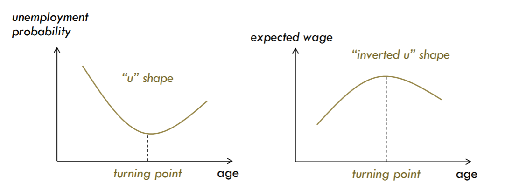

```{r, echo=FALSE, message=FALSE, warning=FALSE}
setwd("C:/Users/bpu058246/Desktop/Teaching/Econometria/Lectures/")
```

class: center, middle, inverse

# **Interpreting and Comparing Regression Models**


---

## Motivations


- Regression coefficients are typically presented as tables that are easy to understand.

- Sometimes, estimates are difficult to interpret, especially for interaction or transformed terms (quadratic or cubic terms, polynomials, splines, and for more complex models.

- In such cases, coefficients are no longer interpretable in a direct way and marginal effects are far easier to understand. 

- Marginal effects measure the association between a change in the predictors and a change in the outcome. 

    - It is an effect, not a prediction. 
    
    - It is a change, not a level. 

---

## Preliminaries

- The symbol $\triangle$ stands for change. So $\triangle x_j$ stands for a change in the variable $x_j$

- $\triangle x_j/x$ is a relative change

- Relative changes are always measured in percentage while “change” is measured in the same unit as the original variable

- There is only one exception to the above rule: if a variable is in percentage then its change is in “percentage points”

- Example: If an interest rate increases from 20% to 21% it increases by 1 percentage point (change) or 5% (relative change)

---

## Marginal Effects


- We are often interested in understanding how a small change in an independent variable (say variable $x_j$) impacts the dependent variable $y$ while holding all other variables constant.

- **Marginal effects are partial derivatives of the regression equation with respect to each variable in the model.**

- We know that if $E(y|x_i) = f(x_i)$ then
$$\triangle E(y|x) \approx \frac{\partial f(x)}{\partial x_j} \triangle x_j$$


- Thus, we can conclude that when $x_j$ changes by one unit, $E(y|x)$ changes by $\frac{\partial f(x)}{\partial x_j}$ holding every other variables constant.

- The above is known as the **partial effect** of variable $x_j$ on $E(y|x)$.

- Remember that the “all other variables constant” condition is known as the *ceteris paribus* condition.


---

## Marginal Effects


- We wish to explore the concept of **elasticity** and how we can use a regression analysis to estimate the various elasticities in which economists have an interest.

    - *e.g., A 16 percent increase in price of gasoline has generated a 4 percent decrease in demand: 16% price change --> 4% quantity change or .04/.16 = .25. --> This is called an inelastic demand meaning a small response to the price change.* 
    
    - *Some goods have many substitutes: pears for apples for plums, for grapes, etc. etc. Here a small percentage change in price will induce a large percentage change in quantity demanded. The consumer will easily shift the demand to the close substitute.*


---

## Marginal Effects

- Elasticity measures the impact of *a (ceteris paribus)* relative change of $x_j$ in terms of a relative change on $E(y|x)$.

$$\frac{\triangle E(y|x)}{E(y|x)} \approx \frac{\partial f(x)}{\partial x_j} \frac{x_j}{f(x)} \frac{\triangle x_j}{x_j} = \frac{\partial log(f(x))}{\partial log(x_j)} \frac{\triangle x_j}{x_j}$$


(the last equality is true if $E(y|x) > 0$ and $x_j > 0$)


- A **semi-elasticity** measures the impact of a (ceteris paribus) change in $x_j$ in terms of a relative change on $E(y|x)$

$$\frac{\triangle E(y|x)}{E(y|x)} \approx \frac{\partial f(x)}{\partial x_j} \frac{1}{f(x)} \triangle x_j = \frac{\partial log(f(x))}{\partial x_j} \triangle x_j$$


---

## Interpreting the Linear Model


- How do we interpret the coefficients of the model?

$$E(y_i|x_i)=\beta_1+\beta_2 x_{2i}+\beta_3 x_{3i} + ...+\beta_k x_{ki}$$ 
Since $\frac{\partial E(y_i|x_i)}{\partial x_{ji}} = \beta_j$ then the partial effect of $x_j$ equals $\beta_j$.

In other words: when $x_j$ increases one unit, $E(y_i|x_i)$ increases $\beta_j$ units, *ceteris paribus*


- But note that the elasticity of $E(y|x)$ with respect to $x_j$ equals $\beta_j \frac{x_j}{f(x)}$ and the semi-elasticity is $\beta_j/f(x)$. Both depend on specific values of $x$.


- In this case the partial effect of $x_j$ has the “simpler” interpretation.


---

## Interpreting the Linear Model


- But what is the partial effect of $x_2$ if


$$E(y_i|x_i)=\beta_1+\beta_2 x_{2i}+\beta_3 x_{2i}^2 + ...+\beta_k x_{ki}$$ 

Now $\frac{\partial E(y_i|x_i)}{\partial x_{2i}} = \beta_2 + 2\beta_3 x_{2i}$ and thus the partial effect of $x_2$ depends on the value of $x_2$


- And what about the case

$$E(y_i|x_i)=\beta_1+\beta_2 x_{2i}+\beta_3 x_{2i} x_{3i} + ...+\beta_k x_{ki}$$ 
Now $\frac{\partial E(y_i|x_i)}{\partial x_{2i}} = \beta_2 + \beta_3 x_{3i}$ and thus the partial effect of $x_2$ depends on the value of $x_3$


---

## Interpreting the Linear Model

- How do we interpret the coefficients of the model?

$$E(log(y_i|x_i))=\beta_1+\beta_2 log(x_{2i})+\beta_3 log(x_{3i}) + ...+\beta_k log(x_{ki})$$ 

Here $\frac{\partial E(log(y_i|x_i))}{\partial log(x_{2i})} = \beta_2$ and thus in this model the coefficients have a direct interpretation as elasticities

- Similarly in the model

$$E(log(y_i|x_i))=\beta_1+\beta_2 x_{2i}+\beta_3 x_{3i} + ...+\beta_k x_{ki}$$ 

We have $\frac{\partial E(log(y_i|x_i))}{\partial x_{2i}} = \beta_2$ and the coefficients can be read directly as semi-elasticities

---

## Functional Forms

<br />

*There is a plethora of functional transforms one can think of, but what transforms do we use, and when?*

<br />

.font80[

| Transform |  Formula | Description | 
| :--- | :--- |  :--- | 
| **Units Change**  | x/1000 | Only used as a matter of convenience (to make results easier to read).  | 
| **Logs**  | log(x)  | Changes interpreted on a relative scale. May help reduce the effect of outliers (e.g., CEO salary).  | 
| **Squares**  | $x^2$ | Allows for a u-shaped or inverted-u-shaped relationship (e.g., age vs wage).  | 
| **Interactions**  | $x_1.x_2$ | Effect of $x_1$ depends on the level of $x_2$ and vice versa.  | 

]


---

## Functional Forms

### Log Transformations

- Log transformations are often recommended for skewed data, such as monetary measures. 

    - One reason is to make data more “normal”, or symmetric.
    
    - Another reason is to help meet the assumption of constant variance in the context of linear modeling.
    
    - while it’s easy to implement a log transformation, it can complicate interpretation.
    
    
---

## Functional Forms

### Log Transformations

- Only the dependent/response variable is log-transformed - the case of semi-elasticity 

    - E.g., what's the impact of a unit change in experience, say one year, on the percentage change in worker’s wage?
    
    - change in log(y) ≈ relative change in y
    
    - The formula $\triangle y/y =exp(\beta_j)-1$ or $\% \triangle y =100 \times [exp(\beta_j)-1]$ gives the percent increase (or decrease) in the response for every one-unit increase in the independent variable.
    
    - The coefficient is 0.198. For every one-unit increase in the independent variable, our dependent variable increases by about 22% $((exp(0.198) – 1) \times 100)$.
    
---

## Functional Forms

### Log Transformations

- Only independent/predictor variable(s) is log-transformed. 

    - E.g., by how many euros will sales increase if the firm spends X percent more on advertising?
    
    - The formula $\beta_j/100$ tells us the unit increase (or decrease) in the response for every a 1% increase in the independent variable. 
    
    - The coefficient is 0.198. For every 1% increase in the independent variable, our dependent variable increases by about 0.002 (0.198/100). 
    
    - For x percent increase, multiply the coefficient by log(1.x). E.g., For every 10% increase in the independent variable, our dependent variable increases by about 0.198 * log(1.10) = 0.02.
    
    
---

## Functional Forms

### Log Transformations


- Both dependent/response variable and independent/predictor variable(s) are log-transformed - the case of elasticity 

    - E.g., How responsive is the demand for Coca-Cola to changes in the price of Pepsi in percentage terms?

    - Interpret the coefficient as the percent increase in the dependent variable for every 1% increase in the independent variable. 
    
    - The coefficient is 0.198. For every 1% increase in the independent variable, our dependent variable increases by about 0.20%. 
    
    - For x percent increase, calculate 1.x to the power of the coefficient, subtract 1, and multiply by 100. E.g., for every 20% increase in the independent variable, our dependent variable increases by about (1.20^0.198 – 1) * 100 = 3.7 percent.
    
    
---

## Functional Forms

### Log Transformations

.blue[.font120[**A Quick Help**]]

| Instrument|  Main Features| 
| :--- | :--- | 
| $\: \triangle X \rightarrow \: \triangle  Y$  | No transformation |
| $\: \triangle X \rightarrow  \% \triangle  Y$  | Only dependent variable(s) is log-transformed |
| $\% \triangle X \rightarrow \: \triangle  Y$  | Only independent variable(s) is log-transformed |
| $\% \triangle X \rightarrow  \% \triangle  Y$  | Both independent and dependent variable(s) are log-transformed |


---

## Functional Forms

### Squares


- Allow for a changing sign of the relationship

- Note that while logarithms are non-linear transforms, they do not allow the relationship to change sign (log is strictly increasing)

- Many nonlinear functions allow this, but the quadratic is the simplest one --> hardly ever we use anything beyond that 

- u or inverted-u shape? Determined by the sign of the coefficient on the squared term (positive --> u; negative --> inverted u)

---

## Functional Forms

### Squares

- E.g., wage vs. work experience

<div align="center">

</div>


---

## Functional Forms

### Interactions

- Example: Does market reaction to CEO appointment differ for men and women?

- Or: is the effect of CEO appointment on market reaction moderated by gender?

- How do we formulate a model that allows the effect of CEO appointment to vary with gender?

$$\begin{aligned}
Market \: Reaction & = \beta_0 + \beta_1 CEO \: Appointment  \\
& + \beta_2 Female  \\
& + \beta_3 CEO \: Appointment \times Female  \\
\end{aligned}$$
    
---

## Functional Forms

- Even if we restrict ourselves to squares, logs, and interactions, there are many different functional forms we can produce with given variables; how do we choose?

- Angrist and Pischke (2008): *Mostly Harmless Econometrics: An Empiricist’s Companion.*

- We can use F-tests for joint significance test

- Even though some statistical tests have been developed to detect functional form misspecification, we should use them sparingly. The most important criteria are:

    - our research question and the underlying economic theory
    
    - the desired interpretation of the parameters

---

## Regression on Time-Series


- Regressions with time-series values often include time (t) as a regressor (for simplicity we ommit other covariates)

$$E(y_i|t)=\beta_1+\beta_2 t$$ 


- $t$ assumes consecutive discrete values such as $t = 1, 2, 3, 4, 5, ...$

- Assuming that $t$ stands for years $\beta_2$ can be interpreted as the “average annual change” in y

$$E(log(y_i|t)) = \beta_1 + \beta_2 t$$

- If $t$ stood for years, $\beta_2$ would be an estimate of the “average annual (continuous) growth rate”

---

## Regression on Discrete Variables

- If $x_j$ is a discrete variable (say a binary variable) then the partial effect can be computed by comparing $E(y|x)$ at different settings of $x_j$ while holding other variables constant

- Suppose that $x_j$ is a discrete variable with two possible values of 0 and 1 (dummy variable) and


$$E(y_i|x_i ) = \beta_1 + \beta_2 x_{2i} + \beta_3 x_{3i} + ... + \beta_k x_{ki}$$

- The marginal effect is now $E(y_i|x_i)_{x_j=1} − E(y_i|x_i)_{x_j=0} = \beta_j$

- If the dependent variable is in logs, then the relative change $exp(\beta_j ) − 1$ is the partial effect of the dummy

---

## R Commands: Marginal Effects

- The `margins` package provides ways of calculating the marginal effects of variables to make the complex models more interpretable

- It ports the functionality of Stata’s (closed source) `margins` command to (open source) R.


- `margins` calculates average marginal effects which are the mean of these unit-specific partial derivatives over the same sample. 


---

## R Commands: Marginal Effects

.scroll-output[


```{r include=TRUE, warning=FALSE, message=FALSE}
library(margins)
data(mtcars)
reg <- lm(mpg ~ cyl + hp + wt, data = mtcars)
(m <- margins(reg))
summary(m)
```

<br />

<br />

<br />

]

---

## R Commands: Marginal Effects

.scroll-output[

```{r include=TRUE, warning=FALSE, message=FALSE}
library(margins)
plot(m)
```
<br />
]
---

## R Commands: Marginal Effects

- The [**`ggeffects`**](https://cran.r-project.org/web/packages/ggeffects/index.html) package ([Lüdecke 2018](https://joss.theoj.org/papers/10.21105/joss.00772)) aims at easily calculating marginal effects for a broad range of different regression models.

-  **`ggeffects`** allows to interpret a statistical model by making predictions generated by the model when one holds the non-focal variables constant and varies the focal variable(s).

- The **`ggeffects`** package provides a simple, user-friendly interface to calculate marginal effects, which is mainly achieved by one function: `ggpredict()`

- `ggpredict()` holds non-focal terms constant at their mean value (if these are continuous) or at their reference level (for factors).

---

## R Commands: Marginal Effects

- Independent from the type of regression model, the output is always the same, a data frame with a consistent structure.

- The visualization of marginal effects makes it possible to intuitively get the idea of how predictors and outcome are associated, even for complex models.

- The relationship can be differentiated depending on further predictors, which is useful e.g. for interaction terms.

- `ggpredict()` requires at least one, but not more than four terms specified in the terms-argument.

- With more than two variables, predictions can be grouped and faceted.

- The names of these predictors need to be passed as character vector to `ggpredict()`


- There is a dedicated [website](https://strengejacke.github.io/ggeffects/) that describes all the details of this package, including some vignettes with lots of examples.

---

## R Commands: Marginal Effects


```{r include=TRUE, warning=FALSE, message=FALSE}
data(mtcars)
m <- lm(mpg ~ cyl, data = mtcars)
coef(m)["cyl"]
```


---

## R Commands: Marginal Effects

.scroll-output[

```{r include=TRUE, warning=FALSE, message=FALSE}
library(ggplot2)
data(mtcars)
ggplot(mtcars, aes(x = cyl, y = mpg)) + 
  geom_point() +
  geom_abline(intercept = coef(m)["(Intercept)"], 
              slope = coef(m)["cyl"])
```
<br />
]


---

## R Commands: Marginal Effects

For this simple linear model, the slope for the regression line is always the same for each value of our predictor, $cyl$. We can check this by generating predictions of our model.

```{r include=TRUE, warning=FALSE, message=FALSE}
library(ggeffects)
library(ggplot2)
data(mtcars)
m <- lm(mpg ~ cyl, data = mtcars)
ggpredict(m, terms = "cyl")
```

Question: what is the average value of Miles/gallon for observations with 6 cylinders, compared to observations with 4 cylinders?

---

## R Commands: Marginal Effects

<br />

<br />

<br />

`ggeffects` returns predictions for representative values of the focal variable(s), hence you see many predicted values (including confidence intervals) in the output for the different values of the focal term(s).

---

## R Commands: Marginal Effects

.font80[


If we now look at the differences between any two predicted values, we see that these are identical:

```{r include=TRUE, warning=FALSE, message=FALSE}
# Difference between predicted values for cyl = 4 and 6
pr <- ggpredict(m, "cyl [4,6]")
round(diff(pr$predicted), 2)

# Difference between predicted values for cyl = 6 and 8
pr <- ggpredict(m, "cyl [6,8]")
round(diff(pr$predicted), 2)
```

The difference of predicted values that differ by 2 in the focal term, equals 2 times the regression coefficient, because the interpretation of a regression coefficient can be seen as average difference in the outcome, while being at the same levels of all other predictors.
]

**For simple linear models, the regression coefficient is also the marginal effect.**

---

## R Commands: Marginal Effects

.font80[

```{r include=TRUE, warning=FALSE, message=FALSE}
library(ggeffects)
data(mtcars)
m <- lm(mpg ~ hp + wt + cyl + am, data = mtcars)
coef(m)["cyl"]
ggpredict(m, terms = "cyl")
```
]

Now we see that the effect of cylinders on Miles/gallon is less pronounced when we take the confounders (i.e., Gross horsepower, weight, and Transmission) into account. 

---

## R Commands: Marginal Effects


.scroll-output[

```{r include=TRUE, warning=FALSE, message=FALSE}
library(ggeffects)
data(mtcars)
m <- lm(mpg ~ wt * hp + am, data = mtcars)
p <- ggpredict(m, c("hp", "wt", "am"))
plot(p)
```


<br />

<br />
]


---

## R Commands: Marginal Effects

.scroll-output[

```{r include=TRUE, warning=FALSE, message=FALSE}
library(ggeffects)
data(mtcars)
m <- lm(mpg ~ wt * cyl + am, data = mtcars)
ggpredict(m, terms = c("wt", "cyl"))
```

<br />

<br />

]


---

## R Commands: Marginal Effects

We can now plot the marginal effects

.scroll-output[

```{r include=TRUE, warning=FALSE, message=FALSE}
library(ggeffects)
data(mtcars)
m <- lm(mpg ~ wt * cyl + am, data = mtcars)
p <- ggpredict(m, terms = c("wt", "cyl"))
plot(p)
```


<br />

<br />
]


---

## R Commands: Marginal Effects

`ggeffects` also allows easily calculating marginal effects at specific levels of other predictors. This is particularly useful for interaction effects with continuous variables.

.scroll-output[

```{r include=TRUE, warning=FALSE, message=FALSE}
library(ggeffects)
data(mtcars)
m <- lm(mpg ~ wt * hp + am, data = mtcars)
ggpredict(m, c("hp", "wt"))
# p <- ggpredict(m, c("hp", "wt"))
# plot(p)
```


<br />

<br />

]

In this example, both variables of the interaction term have a larger range of values, which obscure the moderating effect.


---

## R Commands: Marginal Effects

However, you can directly specify certain values, at which marginal effects should be calculated, or use "shortcuts" that compute convenient values, like mean +/- 1 SD etc (placed in square brackets directly after the term name and can vary for each model term).

.scroll-output[

```{r include=TRUE, warning=FALSE, message=FALSE}
library(ggeffects)
data(mtcars)
m <- lm(mpg ~ wt * hp + am, data = mtcars)
p <- ggpredict(m, c("hp", "wt[meansd]"))
plot(p)
```


<br />

<br />
]


---

## R Commands: Marginal Effects

- `minmax`: minimum and maximum values (lower and upper bounds) of the variable are used.

- `meansd`: uses the mean value as well as one standard deviation below and above mean value.

- `zeromax`: is similar to the "minmax" option, however, 0 is always used as minimum value. This may be useful for predictors that don’t have an empirical zero-value.

- `quart` calculates and uses the quartiles (lower, median and upper), including minimum and maximum value.

- `quart2` calculates and uses the quartiles (lower, median and upper), excluding minimum and maximum value.

- `all` takes all values of the vector.

---

## R Commands: Marginal Effects

Here is an example with the argument "quart2"


.scroll-output[

```{r include=TRUE, warning=FALSE, message=FALSE}
library(ggeffects)
data(mtcars)
m <- lm(mpg ~ wt * hp + am, data = mtcars)
p <- ggpredict(m, c("hp", "wt [quart2]"))
plot(p)
```

<br />

<br />
]


---

## R Commands: Marginal Effects

The `typical`- argument determines the function that will be applied to the covariates to hold these terms at constant values. By default, this is the mean-value, but other options (like "weighted.mean", "median" and "mode") are possible as well. 

.scroll-output[

```{r include=TRUE, warning=FALSE, message=FALSE}
library(ggeffects)
data(mtcars)
m <- lm(mpg ~ log(hp) + disp, data = mtcars)

# "disp" is hold constant at its mean
p<-ggpredict(m, "hp", typical = "mean")
p
plot(p)
```

<br />

<br />

<br />

]


---

## R Commands: Marginal Effects

Use the `condition`-argument to define other values at which covariates should be held constant. `condition` requires a named vector, with the name indicating the covariate.


```{r include=TRUE, warning=FALSE, message=FALSE}
# "disp" is hold constant at value 200
ggpredict(m, "hp", condition = c(disp = 200))
```


---

## R Commands: Marginal Effects

### In Short

- marginal effects help answer the question: what is the effect of a 1 unit change in $x$ on $y$?

- average marginal effects help answer the question: what is the average effect of a 1 unit change in $x$ on $y$?

- `margins` estimates the average marginal effects at fixed values of some covariates and averaging over the remaining covariates.

- `ggpredict()` helps answer the question: what do I expect the outcome to be if $x$ = 1 (or any other specific value or level)?


---

## Selecting the Set of Regressors

- What happens when a relevant variable is excluded?

    - If the omitted variable is uncorrelated with the included variables, the OLS estimators remain unbiased (although with higher variance).
    
    - If the omitted variable is correlated with the included variables then the OLS estimators become biased - this is called the **omitted variable bias**

- Needlessly including irrelevant variables is not as dangerous. The OLS estimator remains unbiased but its precision is decreased (has higher variance)

---

## Selecting the Set of Regressors

.font80[


- Economic theory should drive the specification

- It is ok to have non-significant regressors

- If there is no guidance from economic theory and we must choose between non-nested models we can use the following criteria:

- Akaike’s Information Criterion (AIC)
    
$$AIC = log(\frac{1}{N}\sum_{i=1}^{N} e_i^2) + 2 \frac{k}{N}$$


- Schwarz Bayesian Information Criterion
    
$$BIC = log(\frac{1}{N}\sum_{i=1}^{N} e_i^2) + \frac{k}{N} log(N)$$


- Models with lower AIC or BIC are preferred

- BIC is preferred asymptotically but AIC works better in small samples

]

---

## R Commands: Selection of Predictors

The BIC and AIC can be computed through the functions BIC and AIC. They take a model as the input.


.scroll-output[

```{r include=TRUE, warning=FALSE, message=FALSE}
library(ggeffects)
data(mtcars)
mod1 <- lm(mpg ~ log(hp) + disp, data = mtcars)
mod2 <- lm(mpg ~ log(hp) + disp + wt, data = mtcars)
mod3 <- lm(mpg ~ log(hp) + disp + wt + cyl, data = mtcars)
mod4 <- lm(mpg ~ log(hp) + disp + wt + cyl + vs, data = mtcars)

# BICs
BIC(mod1)
BIC(mod2) 
BIC(mod3) 
BIC(mod4)

# AICs
AIC(mod1)
AIC(mod2) 
AIC(mod3) 
AIC(mod4)
```

<br />

<br />

<br />

<br />
]

---

## R Commands: Selection of Predictors

`MASS::stepAIC` function helps navigating a ocean of models by implementing stepwise model selection which will iteratively add predictors that decrease an information criterion and/or remove those that increase it, depending on the mode of stepwise search that is performed.


.scroll-output[

```{r include=TRUE, warning=FALSE, message=FALSE}
library(ggeffects)
data(mtcars)
# Full model
mod <- lm(mpg ~ ., data = mtcars)
# With AIC (k = 2 gives the AIC)
modAIC <- MASS::stepAIC(mod, k = 2)
# The result is an lm object
summary(modAIC)
```
<br />

<br />

<br />

<br />
]

---

## R Commands: Selection of Predictors

`MASS::stepAIC` function helps navigating a ocean of models by implementing stepwise model selection which will iteratively add predictors that decrease an information criterion and/or remove those that increase it, depending on the mode of stepwise search that is performed.


.scroll-output[

```{r include=TRUE, warning=FALSE, message=FALSE}
library(ggeffects)
data(mtcars)
# Full model
mod <- lm(mpg ~ ., data = mtcars)
# With BIC (k = log(n))
modBIC  <- MASS::stepAIC(mod, k = log(nrow(mtcars)))
# The result is an lm object
summary(modBIC)
```

<br />

<br />

<br />

<br />
]
